# Requirement Atomizer 架构图

> 这是项目的可维护架构图源文件。`architecture.svg` 由本文件中的 Mermaid 图生成，修改架构时先更新这里，再重新生成 SVG。

## 系统边界

项目把 DOCX、XLSX、PDF 技术文档转换为带来源证据的功能需求，并通过桌面审核界面完成裁决、澄清和交付。默认路径是功能需求轨； Legacy A 仅保留为显式选择的兼容路径。

```mermaid
flowchart LR
    User["需求分析人员"]

    subgraph Desktop["桌面应用层"]
        Vue["Vue3 UI<br/>App.vue<br/>DocumentReview.vue<br/>FunctionalReview.vue"]
        Bridge["preload / desktop-bridge"]
        Electron["Electron 主进程"]
    end

    subgraph Entry["入口与编排"]
        CLI["cli.py<br/>ratomizer"]
        Tasks["desktop_tasks.py<br/>chain / task bridge"]
        API["api_server.py<br/>本地审核 API"]
        Plan["pipeline_plan.py<br/>策略与阶段计划"]
    end

    subgraph Parse["解析与上下文"]
        Parsers["parsers/<br/>DOCX / XLSX / PDF"]
        IR["文档 IR<br/>blocks / chunks / tables"]
        Regions["最终解析分区<br/>视觉/文本回退 + doc_region"]
        Semantic["semantic_segmentation.py<br/>LLM/确定性语义分段"]
        Candidates["requirement_candidates.py<br/>候选分类 + 覆盖审计"]
    end

    subgraph Functional["默认功能需求轨"]
        Extract["functional_extract.py<br/>条款级功能需求抽取"]
        Context["doc_map / outline / terms<br/>抽取上下文与领域引用"]
        Units["extraction_units.py<br/>统一抽取单元（内部计划）"]
        Router["unit_router.py<br/>A / B / mixed / context / review（影子）"]
        Guard["守恒检查与质量门禁<br/>evidence / obligation / preservation"]
        FR["functional_requirements.json<br/>行为、约束、例外与来源"]
        Analysis["requirements_analysis*<br/>规则分析、可选富化、澄清"]
        Review["review_state / ai_review_actions<br/>接受、拒绝、讨论与裁决"]
        Delivery["clarification / translation<br/>template / export / composer"]
        Annotation["doc_annotation_export.py<br/>批注 HTML / PDF / JSON"]
    end

    subgraph LLM["LLM 基础设施"]
        Client["llm_client.py<br/>路由、重试、预算、trace"]
        Runner["llm_job_runner.py<br/>批量作业与 attempt ledger"]
        Cache["paid_cache_store.py<br/>成功结果缓存与血统"]
        Routes["config.py / model routes<br/>模型与环境配置"]
    end

    subgraph Legacy["Legacy A 兼容轨（显式选择）"]
        Atomize["atomize.py<br/>atomic candidates"]
        Pipeline["llm_pipeline.py<br/>legacy review"]
        Assemble["assemble_spec / cosem_*<br/>历史规格组装"]
    end

    subgraph Storage["结果与知识存储"]
        Package["result_package.py<br/>manifest / governed paths"]
        Out["out/<结果包><br/>deliverables + .ratomizer state/cache/logs"]
        KB["requirement_kb / blue book<br/>领域知识与引用"]
    end

    User --> Vue
    Vue <--> Bridge
    Bridge <--> Electron
    Vue <--> API
    Electron --> Tasks
    CLI --> Tasks
    Tasks --> Plan
    Tasks --> Parsers
    API --> Review

    Parsers --> IR
    IR --> Regions
    Regions --> Semantic
    Semantic --> Candidates
    Candidates --> Extract
    Context --> Extract
    Extract -. "内部规划" .-> Units
    Units --> Router
    Router -. "路由计划/影子审计" .-> Extract
    Extract --> Guard
    Guard --> FR
    FR --> Analysis
    Analysis --> Review
    Review --> Delivery
    Delivery --> Annotation

    Extract -. LLM jobs .-> Runner
    Analysis -. LLM jobs .-> Runner
    Runner --> Client
    Client --> Routes
    Runner --> Cache
    Analysis --> KB
    Extract --> KB

    Atomize --> Pipeline
    Pipeline --> Assemble

    Tasks --> Package
    Annotation --> Package
    Delivery --> Package
    Package --> Out
    Cache --> Out

    classDef ui fill:#e8f1ff,stroke:#2f6feb,color:#0f2c63;
    classDef entry fill:#eef2f7,stroke:#64748b,color:#1e293b;
    classDef core fill:#e8f7ef,stroke:#218739,color:#123c24;
    classDef llm fill:#fff4db,stroke:#b7791f,color:#5b3b08;
    classDef legacy fill:#f4f4f5,stroke:#71717a,color:#3f3f46;
    classDef storage fill:#f1e9ff,stroke:#805ad5,color:#352263;

    class Vue,Bridge,Electron ui;
    class CLI,Tasks,API,Plan entry;
    class Parsers,IR,Regions,Semantic,Candidates,Context,Units,Router,Extract,Guard,FR,Analysis,Review,Delivery,Annotation core;
    class Client,Runner,Cache,Routes llm;
    class Atomize,Pipeline,Assemble legacy;
    class Package,Out,KB storage;
```

## 维护边界

- **功能需求轨是默认交付路径**：抽取以条款为单位保留上下文，守恒和质量门禁决定下游是否具备交付资格。
- **解析分区与候选筛选先于功能抽取**：视觉/文本回退完成后，才写入 doc_region、语义单元、候选分类和覆盖审计；功能抽取只消费这次最终分区。
- **统一抽取单元与路由是计划/审计层**：它们为质量优先策略提供 A/B/mixed 路由依据，默认链路通过影子边观察，不替代候选筛选和功能抽取的权威输入。
- **LLM 只通过统一基础设施进入**：路由、预算、重试、缓存和调用血统由 `llm_client`、`llm_job_runner` 和 `paid_cache_store` 负责。
- **证据与裁决独立于展示层**：Vue 工作台和静态批注 HTML 共享同一需求投影，不在界面层重新推断需求事实。
- **结果包是边界**：状态、缓存、日志和阶段文件写入 `.ratomizer/`，根目录只保留注册的交付物。
- **Legacy A 不应混入默认路径**：只有显式选择兼容模式时，才进入原子候选和历史规格组装链。
