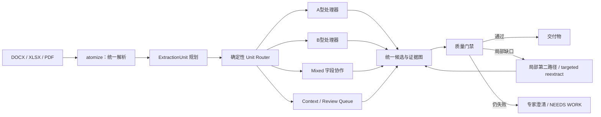

# Requirement Atomizer 效果优先的单元级自动路由完整方案

**日期：** 2026-08-16  
**适用基线：** `codex/table-translation-structure` 当前工作树  
**方案状态：** 最终实施方案  
**核心原则：** 用户选择交付目标，系统选择技术路径；先保证效果，再通过单元级路由和局部升级控制成本

本方案取代此前“由普通用户选择 A/B Profile”的产品设计。A 轨、B 轨和双轨只保留为内部执行策略及高级诊断覆盖，不作为普通用户必须理解的选项。

## 1. 最终目标

系统应做到：

1. 自动识别同一文档中不同类型的内容单元。
2. 为每个条款、表格行或单元格选择最适合的处理路径。
3. 同时包含 A/B 信息的单元按字段协作，不做整单元无条件双重生成。
4. 通过确定性质量门禁判断效果是否达到交付要求。
5. 只有门禁失败的单元才运行第二路径或 targeted reextract。
6. 预算耗尽或模型不可用时如实标记 NEEDS WORK，不以降质结果冒充完成。
7. 所有付费调用都可解释、可缓存、可计量、可封顶、可回滚。

最终运行原则：

```text
按单元分流
  -> 按字段协作
  -> 按质量门禁验收
  -> 按缺口局部升级
  -> 文档级确定性合并和闭环
```

## 2. 非目标与红线

### 2.1 非目标

本方案不直接：

- 降低 `ai_extract` self-check/verify 轮数；
- 把 tool-loop review 改成无工具批处理；
- 一次性拆分全部顶层模块；
- 把不同 review authority 合并为同一个状态机；
- 在无 truth set 的情况下把 `clause_family` 静默翻成默认；
- 为追求零调用而缓存 failed、partial 或证据不完整结果。

### 2.2 红线

- OBIS、class_id、attribute、access 等结构字段仍只允许确定性依据。
- 模型输出不得补造原文不存在的编号、数值、单位或协议字段。
- stub、rule fallback、partial、failed 的来源必须如实记录。
- source quote、source anchor、route requested 和 model provenance 不得失真。
- 守恒、table-cell closure、cross-script review 等 blocking gate 不得因预算降低而绕过。
- 所有结果包状态、缓存、日志和 stage 文件必须使用 governed addressing。
- 共享文件继续使用跨进程锁、fsync、原子替换和 Windows retry。

## 3. 当前基线

### 3.1 当前默认运行事实

启用 LLM、缓存冷启动时，当前 UI 大致执行：

```text
atomize                                         确定性
llm-review                                      A轨付费
functional-extract                             B轨付费
assemble/spec_enrich                           A轨付费
requirements-analysis                          默认确定性
full-translation                               付费
export-annotation-html                         缓存缺失时可能补调 marker 翻译
```

校正说明：

- `RATOMIZER_REQUIREMENTS_ANALYSIS_ENRICH=0`，所以 requirements analysis 富化默认不付费。
- `RATOMIZER_CONTEXT_PACK_STRATEGY=legacy`，所以 functional extract 默认仍是文档级 prompt；`clause_family` 是 opt-in。
- 关闭 `full-translation` 并不能自动保证零翻译调用，因为 annotation export 也可以生成 marker 翻译。

### 3.2 当前主要成本问题

- A/B 两轨主要付费阶段按整文档同时运行。
- 全文翻译默认入链。
- 文档级预算默认关闭。
- tool-loop 累积回传历史，截断升级和 JSON repair 会完整重发。
- functional extract 外围缓存为整文档粒度。
- stage fingerprint 混入无关 LLM 配置。
- 多套 LLM runner、缓存和原子写机械重复。

## 4. 用户与系统的职责边界

### 4.1 用户选择的内容

普通用户只选择业务交付目标：

- 是否生成公司模板需求表；
- 是否生成 COSEM/DLMS 实现规格；
- 是否生成双语交付物；
- 是否进入正式专家审计；
- 是否生成批注 HTML/PDF；
- 是否允许付费补抽或定点重抽。

### 4.2 系统决定的内容

系统自动决定：

- 单元走 A 轨、B 轨、Mixed 协作还是 Context；
- 是否需要工具化 review；
- 是否需要局部第二路径；
- 是否复用缓存；
- 是否触发 targeted reextract；
- 如何分配阶段预算和 retry 上限。

### 4.3 高级覆盖

仅在高级设置和评测工具中提供：

```text
quality_first      默认自动路由
force_a            强制 A 轨，诊断/回归使用
force_b            强制 B 轨，诊断/回归使用
full_dual_audit    全量双轨，正式对比和评测使用
legacy_combined    兼容和紧急回滚
```

普通 UI 默认只展示“质量优先”，不要求用户理解轨道含义。

## 5. 总体架构



## 6. ExtractionUnit 统一单元模型

### 6.1 新文件

建议新增：

- `extraction_units.py`
- `unit_router.py`
- `unit_routing_models.py`
- `schemas/extraction_unit.schema.json`
- `schemas/unit_routing_decision.schema.json`
- `tests/test_extraction_units.py`
- `tests/test_unit_router.py`

### 6.2 单元粒度

| 来源 | 单元粒度 |
|---|---|
| 普通正文 | clause/chunk 中的规范性句段 |
| 列表 | 每个 requirement-shaped list item |
| 表格 | row、cell 或 mixed leaf |
| 合并单元格 | canonical merge anchor |
| 跨页表格 | continuation 合并后的结构单元 |
| 定义/引用 | context unit，不直接生成需求 |
| 标题/说明 | context 或 review candidate |

### 6.3 建议 Schema

```json
{
  "schema": "extraction-unit/v1",
  "unit_id": "TBL-001-R004-C003",
  "unit_kind": "table_cell",
  "source_text": "Attribute 2 shall be readable.",
  "source_text_hash": "sha256:...",
  "clause_path": ["6", "6.12"],
  "source_block_ids": ["BLK-0081"],
  "table_context": {
    "table_id": "TBL-001",
    "row_index": 4,
    "column_index": 3,
    "headers": ["Attribute", "Requirement"]
  },
  "roles": ["requirement_candidate"],
  "context_refs": ["DEF-event-record"],
  "locator": {
    "source_type": "table_cell",
    "source_id": "TBL-001-R004-C003"
  }
}
```

### 6.4 单一事实源

ExtractionUnit 由现有 `chunks.jsonl`、`table_cell_items.jsonl`、table dispositions、definitions 和 references 确定性构建。

不得让 A 轨和 B 轨各自重新切分同一原文，否则 source span、缓存 key 和守恒单位仍会分叉。

## 7. Unit Router

### 7.1 路由类型

```text
a_track     结构化协议/对象模型单元
b_track     行为/功能需求单元
mixed       同时含行为义务和结构化实现约束
context     定义、引用、标题、说明等上下文
review      信号不足但不能安全排除
```

### 7.2 路由必须确定性

第一版 Unit Router 不调用 LLM。理由：

- 路由本身不应成为新的付费阶段；
- 同一输入必须得到稳定结果；
- 路由证据必须可审计；
- 规则不足时可以进入 mixed/review，而不是猜测。

### 7.3 A 型信号

强信号包括：

- 合法 COSEM class / class_id；
- 经知识库验证的 OBIS；
- attribute、method、access mode；
- PDU、service、状态机；
- 数据类型、枚举、对象关系；
- DLMS profile 表格；
- Blue Book 可确定性关联的对象定义；
- 表格 role 明确为 class/attribute/method/access/profile。

### 7.4 B 型信号

强信号包括：

- shall、must、应、必须等规范性模态；
- 主体 + 动作 + 对象；
- 条件、触发器、异常行为；
- 性能、时间、容量或验收标准；
- 标书功能清单；
- noun-phrase specification 经现有 B 轨规则识别为功能义务；
- 明确的软件/系统职责。

### 7.5 Context 信号

- definitions、term rows；
- normative references；
- caption、header、title；
- 仅用于限定邻近需求的参数说明；
- 已被 table disposition 标为 context；
- 不含义务信号的纯描述。

### 7.6 Mixed 判定

当一个单元同时存在强 A 和强 B 信号时标记 Mixed，例如：

```text
The meter shall expose event records through
interface class 7, attribute 2, with read-only access.
```

其中：

- `shall expose event records` 是 B 型义务；
- `class 7 / attribute 2 / read-only` 是 A 型实现约束。

### 7.7 评分与硬规则

Router 输出两个独立分数，不使用一个互相抵消的总分：

```text
a_score = 结构化协议证据分
b_score = 行为义务证据分
```

建议规则：

```text
存在已验证结构硬信号且 B 弱       -> a_track
存在规范义务硬信号且 A 弱         -> b_track
A/B 都有硬信号                    -> mixed
无义务、属于定义/引用/标题          -> context
信号弱、冲突或存在 requirement shape -> review
```

阈值必须通过 golden/real corpus 标定，不在代码中散落魔法数字。

### 7.8 路由决策 Schema

```json
{
  "schema": "unit-routing-decision/v1",
  "unit_id": "CLAUSE-6.12-S02",
  "route": "mixed",
  "primary_route": "b_track",
  "a_score": 0.88,
  "b_score": 0.95,
  "confidence": 0.93,
  "evidence": [
    {"kind": "modal", "value": "shall"},
    {"kind": "class_id", "value": "7"},
    {"kind": "attribute", "value": "2"}
  ],
  "router_version": "unit-router-v1",
  "decision_basis": "deterministic"
}
```

路由决策写入 governed pipeline artifact，例如 `unit_routing_decisions.jsonl`，进入 stage fingerprint 和结果包 lineage。

## 8. Mixed 单元处理

### 8.1 不完整双跑

Mixed 不等于把完整原文分别交给两个 LLM 再生成两条需求。

正确处理：

1. B 轨提取行为义务、条件、触发器和验收语义。
2. A 轨优先用确定性知识库解析 class、OBIS、attribute、method、access。
3. 两者使用相同 `unit_id` 和 obligation identity。
4. A 型字段作为 B 型需求的 implementation constraints 合并。
5. 只有 A 型结构无法确定或 B 型义务未覆盖时才局部补调。

### 8.2 输出示例

```json
{
  "requirement_id": "FREQ-...",
  "source_unit_id": "CLAUSE-6.12-S02",
  "software_requirement_text": "电表应提供事件记录读取功能。",
  "implementation_constraints": {
    "class_id": 7,
    "attribute_id": 2,
    "access": "read_only"
  },
  "route_provenance": {
    "behavior": "b_track",
    "structured_fields": "deterministic_a_join"
  }
}
```

### 8.3 去重键

去重不能只靠文本相似度。建议使用：

```text
source_unit_id
obligation_id
actor/action/object canonical identity
structured target identity
```

Mixed 合并后只能形成一个 authoritative requirement，A/B 临时候选保留在审计产物中，不同时进入最终交付物。

## 9. 路由执行策略

### 9.1 Primary Route

每个单元只选择一个主要付费提取路径：

- A 型：A 轨结构化处理；尽可能零 LLM。
- B 型：functional extract/B 轨提取。
- Mixed：通常 B 轨负责义务文本，A 轨确定性补结构字段。
- Context：只进入上下文索引。
- Review：物化为候选，等待规则补充、局部双轨或专家判断。

### 9.2 Secondary Route Trigger

只有以下情况触发第二路径：

- obligation 未覆盖；
- source anchor 不完整；
- Mixed 结构字段存在未解析引用；
- table-cell closure 发现目标单元无 authoritative disposition；
- structured constraints 与 narrative requirement 冲突；
- cross-script review 阻断；
- 当前路径返回 partial/failed；
- 专家显式要求 reextract。

### 9.3 局部升级

```text
单元初次处理
  -> 单元级/文档级 gate 发现缺口
  -> 生成 gap record
  -> 只对 gap 涉及 unit 执行 secondary processor
  -> 原子合并
  -> 重新运行受影响 gate
```

不得因为一个单元失败，默认将整文档切换为 full dual run。

## 10. 质量门禁

效果优先必须通过可执行门禁体现，而不是依赖“用了更多模型”。

### 10.1 单元级门禁

- source text hash 与当前原文一致；
- requirement quote 可在 source jurisdiction 内定位；
- structured code/number/unit 未伪造；
- actor/action/object 或结构 target 完整；
- Mixed 合并没有丢失义务或约束；
- 输出 schema、状态和 provenance 完整。

### 10.2 文档级门禁

- obligation conservation；
- functional coverage；
- table-cell closure；
- claim catalog/publish/fold/queue 闭环；
- cross-script blocking questions；
- clarification blocking 状态；
- 未解决 review candidate；
- result package completion evidence。

### 10.3 Gate 结果

```text
PASS          可以交付
RETRY_LOCAL   局部第二路径或 targeted reextract
NEEDS_REVIEW  专家确认
NEEDS_WORK    预算/模型/守恒/来源问题阻断
```

不得用全量双轨是否运行过作为 PASS 条件；PASS 只由质量证据决定。

## 11. PipelinePlan

### 11.1 内部执行模式

PipelinePlan 的默认 `execution_policy` 改为：

```text
quality_first
```

计划不再预先决定整文档只跑 A 或 B，而是声明：

- 必须先生成 ExtractionUnits；
- 必须运行 Unit Router；
- 根据路由统计构造具体 processor jobs；
- 根据 gate 结果追加局部任务。

### 11.2 建议 Schema

```json
{
  "schema": "ratomizer-pipeline-plan/v2",
  "execution_policy": "quality_first",
  "delivery": {
    "software_requirements": true,
    "cosem_spec": true,
    "template_workbook": true,
    "annotation_bundle": true,
    "translation_mode": "off"
  },
  "budget_mode": "observe",
  "stages": [
    "atomize",
    "plan-extraction-units",
    "route-units",
    "execute-routed-units",
    "merge-routed-results",
    "quality-gates",
    "targeted-escalation",
    "publish-deliverables"
  ],
  "plan_fingerprint": "sha256:..."
}
```

### 11.3 动态阶段与结果包

结果包 requested stages 记录稳定的逻辑阶段，而不是每个动态 unit job。

每个 unit job 写入独立 attempt/progress ledger，并由逻辑阶段汇总完成状态。

## 12. 用户交付选项

### 12.1 Translation Mode

保留：

```text
off       不生成新翻译
markers   只翻译批注 marker
full      全文双语交付
```

这是用户可以选择的业务输出，不是技术轨道。

### 12.2 其他交付开关

- 软件需求列表；
- COSEM/DLMS 规格；
- 公司模板；
- 澄清报告；
- 批注视图；
- 全文双语。

交付选项影响最终投影和必要的内部处理器，但不让用户直接选择 A/B。

## 13. 翻译改造

拆分：

```text
maintain_translation_cache()       确定性迁移/失效，零 LLM
generate_marker_translations()     markers 模式
generate_full_translations()       full 模式
```

`export_annotation_bundle()` 接受显式 `translation_mode`：

- off：只维护缓存并渲染；
- markers：补齐 marker；
- full：只读取全文 sidecar，不新增调用。

必须用 provider call counter 证明 off 模式零翻译调用、full 完成后 export 零新增翻译调用。

## 14. Budget 设计

```text
off       兼容/紧急回滚
observe   记录、预警，不阻断
enforce   调用前拦截
```

质量优先不等于无限预算：

- 先用 observe 建立每种 unit/processor 的真实分布；
- enforce 只阻止继续付费，不能把不完整结果标为成功；
- 预算不足时停止非必要 enrichment；
- blocking gap 未闭合时标记 NEEDS WORK；
- 专家可以显式授权局部追加预算。

预算应按 unit job、processor、文档累计三个层级记账。

## 15. StageContract 与指纹

新增阶段契约：

| 逻辑阶段 | 关键依赖 |
|---|---|
| plan-extraction-units | chunks、table cells、table dispositions、unit planner version |
| route-units | unit hashes、KB/domain signals、router rules/version |
| execute-a-units | A unit set、COSEM/KB versions、structured processors |
| execute-b-units | B/Mixed primary unit set、prompt/model/context strategy |
| merge-routed-results | processor result hashes、merge version |
| quality-gates | merged result、source hashes、gate versions |
| targeted-escalation | gap records、budget authorization、processor versions |
| translation | translation mode、eligible texts、translation versions |

删除当前所有阶段共享的全局 LLM env fingerprint。无关配置变化不得使其他阶段失效。

路由规则版本变化时只重新路由受影响 unit；processor input set 未变化的 unit 应继续复用。

## 16. 缓存架构

### 16.1 PaidCacheStore

统一：

- governed addressing；
- process lock；
- fsync；
- atomic replace；
- Windows retry；
- torn-tail recovery；
- successful-only；
- usage/provenance；
- hit/miss/invalidation telemetry。

第一批迁移 `spec_enrich` 和 `ai_extract` 裸 append。

### 16.2 两层缓存

```text
ModelResponseCache
  完整 canonical request identity -> 原始成功响应

DerivedResultCache
  原始响应 hash + postprocess versions -> 当前领域结果
```

版本分类：

```text
request_affecting
postprocess_only
presentation_only
```

只有 postprocess-only bump 可以零 provider 调用重放。

### 16.3 Unit 缓存

Unit 缓存 key 至少包括：

- unit id/text hash；
- context unit hashes；
- route decision hash；
- processor/request versions；
- model/provider identity；
- evidence fingerprint；
- delivery-relevant config。

## 17. Functional Extract 增量化

当前 legacy 整文档 prompt 不支持真正 unit 级 provider 复用。

实施顺序：

1. 在 `clause_family` opt-in 路径接入 ExtractionUnit 和 package cache。
2. B 型/Mixed primary unit 各自调用或安全合批。
3. 文档级结果由 unit 快照确定性重建。
4. 守恒仍在文档级运行。
5. 用 truth set 比较 legacy 和新 unit route。
6. 通过 mandatory thresholds 后再翻默认执行策略。

强制 A/B 覆盖模式继续保留，供评测 unit router 是否漏路由。

## 18. LLMJobRunner

统一 single-shot/batch 机械：

- route/model；
- request identity；
- budget；
- PaidCacheStore；
- schema/JSON repair；
- retry 分类；
- usage/provenance；
- progress；
- ok/partial/failed。

tool-loop 第一版只接入 budget 和 telemetry，不重写证据循环，也不套用普通 raw response cache。

每次 attempt 记录：

```text
stage / processor / unit_id
initial / 429 / 5xx / truncation / json_repair / split / fallback
prompt / completion / total tokens
duration
cache/provider
parent attempt id
```

## 19. Gap 与局部升级模型

新增 `routing_gaps.jsonl` 或复用统一 gap artifact，建议字段：

```json
{
  "gap_id": "GAP-...",
  "unit_id": "CLAUSE-6.12-S02",
  "gate": "obligation_coverage",
  "reason": "local obligation has no eligible FRE",
  "primary_route": "b_track",
  "recommended_action": "targeted_secondary_route",
  "blocking": true,
  "source_hash": "sha256:..."
}
```

局部升级必须复用现有 claim queue/CAS/WAL/预算机械，避免再创建第八条独立重抽通道。

## 20. 前端设计

### 20.1 普通设置

展示业务目标：

- 需求列表；
- COSEM 规格；
- 公司模板；
- 批注交付；
- 翻译模式；
- 正式专家审计。

不展示 A/B 技术选择。

### 20.2 运行预览

运行前展示：

- 系统将使用“质量优先自动解析”；
- 预计处理的 clauses/tables/cells；
- 预计 paid unit 数；
- translation mode；
- budget 状态；
- 缓存可复用数量。

无需向用户解释内部 prompt 或工具循环。

### 20.3 运行中

进度以逻辑阶段和 unit 数显示：

```text
解析文档
规划 326 个内容单元
路由完成：A 42 / B 87 / Mixed 13 / Context 180 / Review 4
处理 B 型单元 67/87
质量检查
局部补抽 3/4
生成交付物
```

### 20.4 高级诊断

可查看路由依据、强制单元重新路由、force A/B、全量双轨 A/B 对比，但不进入普通主流程。

## 21. Backend 变更

### 21.1 新模块

- `extraction_units.py`
- `unit_router.py`
- `unit_routing_models.py`
- `pipeline_contracts.py`
- `pipeline_plan.py`
- `routed_execution.py`
- `routing_gaps.py`
- `paid_cache_store.py`
- `llm_job_runner.py`

### 21.2 现有入口改造

`desktop_tasks.py`：

- 增加 plan/route/execute/gate/escalate 任务；
- `run_pipeline_task` 只负责执行 PipelinePlan；
- `chain_task` 不再自行替换 A/B 阶段；
- 进度事件带 unit counts 和 plan fingerprint。

`cli.py`：

```text
--execution-policy quality_first|force_a|force_b|full_dual_audit|legacy_combined
--translation off|markers|full
--budget-mode off|observe|enforce
--plan-only
```

普通默认 `quality_first`。

## 22. Result Package 与 Manifest

记录：

- execution policy；
- plan fingerprint；
- unit planner/router versions；
- routing summary；
- delivery options；
- translation/budget mode；
- logical requested stages；
- paid processor counts；
- gate summary；
- targeted escalation summary。

旧结果包无 routing metadata 时按 legacy 只读兼容，不伪造 unit decisions。

结果包 complete 必须以 gate PASS 为准，而不是“所有配置阶段都运行过”。

## 23. Review/IO 基础设施

不合并领域 authority，只统一：

- typed append store；
- CAS/fingerprint codec；
- process lock；
- WAL replay；
- atomic replace；
- conflict base；
- projection snapshot helper。

优先扩展已有 `artifact_store.py`、`process_file_lock.py`、`io_utils.py`，不再创建互相竞争的新 IO 体系。

## 24. 文件级变更表

| 文件 | 变更 |
|---|---|
| `config.py` | execution policy、translation mode、budget mode、router thresholds |
| `atomize.py` | 输出统一 ExtractionUnit 所需稳定信息，不直接执行路由 |
| `table_structure.py` | 暴露稳定 table role/cell evidence 给 unit planner |
| `extraction_units.py` | 新增 unit planner |
| `unit_router.py` | 新增确定性 A/B/Mixed/Context/Review 路由 |
| `pipeline_contracts.py` | 逻辑阶段、依赖和 config dependencies |
| `pipeline_plan.py` | quality-first 计划、fingerprint、验证 |
| `routed_execution.py` | unit jobs、processor dispatch、结果汇总 |
| `routing_gaps.py` | gate gap 和 escalation plan |
| `desktop_tasks.py` | plan/route/execute/gate 接线，删除隐式整轨替换 |
| `cli.py` | execution policy、delivery、plan-only |
| `functional_extract.py` | B/Mixed unit 输入、package cache、确定性重建 |
| `llm_pipeline.py` | A unit review/高级审计接线，不默认全文逐需求 review |
| `assemble_spec.py` / `spec_enrich.py` | 只消费 A/Mixed 结构目标或明确需要的 enrich unit |
| `requirements_analysis.py` | 消费合并后的 authoritative functional requirements；enrich 默认状态如实 |
| `doc_annotation_export.py` | translation maintenance/markers/full 职责拆分 |
| `full_translation.py` | 仅 full delivery 模式生成 |
| `llm_budget.py` | off/observe/enforce + unit processor budget |
| `llm_client.py` | attempt telemetry |
| `paid_cache_store.py` | 统一付费缓存 |
| `llm_job_runner.py` | 统一 single-shot/batch 机械 |
| `result_package.py` | plan/routing/gate completion evidence |
| `api_server.py` | 路由查询、gap、局部 override API |
| `ui/src/App.vue` | 业务交付设置、自动路由进度、隐藏普通 A/B 选择 |
| `ui/src/api-client.ts` | plan/routing/gate 类型和 API |
| Electron bridge/types | plan/execute/routing IPC |
| schemas | extraction unit、routing decision、plan、gap、cache schema |

## 25. 实施里程碑

### M0：冻结基线

工作：

- 三类真实文档跑 cold/warm；
- 记录当前 A/B/full translation calls/tokens；
- 保存当前 precision/recall/F1、守恒和 closure；
- 建立 fake provider call recorder。

完成条件：成本与效果基线可重复。

### M1：ExtractionUnit

工作：

- 从 chunks/table cells 构建统一 unit；
- 定义稳定 unit id/source hash；
- Context/requirement/table 单元不丢失。

完成条件：所有源义务和非空 canonical table cell 都能追溯到 unit。

### M2：Unit Router Shadow Mode

工作：

- 实现确定性路由；
- 只产 routing decisions，不改变当前执行；
- 对现有 A/B 结果回放比较。

完成条件：路由覆盖率、误路由和 review 比率有真实统计。

### M3：Mixed 合并与质量门禁

工作：

- 定义 obligation identity；
- A 字段 + B 义务合并；
- 建立 unit/document gates；
- 输出 routing gaps。

完成条件：Mixed 不重复进入最终需求，blocking gap 可定位。

### M4：Quality-first 主执行

工作：

- PipelinePlan 默认 quality_first；
- 按路由生成 processor jobs；
- 旧 combined 模式保留回滚。

完成条件：B 单元不启动全文 A review，A 单元不启动全文 B extract。

### M5：局部升级

工作：

- gap -> secondary route/targeted reextract；
- 复用 claim queue/CAS/WAL/budget；
- 只重跑影响 unit。

完成条件：单个缺口不会触发整文档双轨。

### M6：Translation/Budget/Plan 控制面

工作：

- translation off/markers/full；
- budget observe/enforce；
- plan/result package 接线；
- 消除 annotation export 隐藏调用。

完成条件：off 零翻译调用，计划与实际一致。

### M7：缓存

工作：

- PaidCacheStore；
- 两层缓存；
- functional unit/package cache；
- fingerprint dependencies。

完成条件：单 unit 变化只重跑必要 unit；postprocess-only bump 零 provider call。

### M8：LLMJobRunner 与遥测

工作：

- 统一 single-shot/batch；
- retry token 可见；
- tool-loop 保留专用 adapter。

完成条件：所有 provider attempts 可归属到 stage/processor/unit。

### M9：结构收敛

工作：

- review/IO primitives；
- package 化；
- 大型文件拆分；
- CURRENT_STATE/ADR。

完成条件：不改变已验收执行语义，独立通过全量/golden。

## 26. 测试方案

### 26.1 新增测试

```text
test_extraction_units.py
test_unit_router.py
test_unit_router_mixed.py
test_routed_execution.py
test_routing_gaps.py
test_quality_gates.py
test_targeted_escalation.py
test_pipeline_plan_quality_first.py
test_translation_mode_no_hidden_calls.py
test_stage_config_dependencies.py
test_paid_cache_store.py
test_model_response_cache_identity.py
test_functional_unit_cache.py
test_result_package_routing_completion.py
```

### 26.2 关键用例

- 同一文档同时包含 COSEM 表和 prose shall 条款。
- 同一句包含 shall + class/attribute/access，必须路由为 Mixed。
- 定义和引用进入 Context，不单独调用 LLM。
- 弱信号表格 cell 进入 Review，不静默排除。
- B 单元主处理后 obligation gate 失败，只局部升级。
- Mixed 合并只产生一个 authoritative requirement。
- structured code 无依据时不能从 LLM 结果进入最终字段。
- translation off 时 full/export 两条路径均零翻译调用。
- budget exhaustion 产生 NEEDS WORK，不产生假成功。
- force A/B/full dual 的结果用于评测，不污染 quality-first cache namespace。

### 26.3 全量命令

```powershell
python -m unittest discover -s tests
cd ui
cmd /c "npm test"
cmd /c "npm run build"
```

行为版本变化后执行规定的 golden `out/` 再生成流程。

## 27. 效果验收指标

### 27.1 路由质量

| 指标 | 目标 |
|---|---:|
| truth-set A 型单元召回 | 不低于批准基线 |
| truth-set B 型单元召回 | 不低于批准基线 |
| Mixed 单元识别率 | 建立 truth set 后设门槛 |
| Context 被错误付费抽取率 | 接近 0 |
| Review 单元静默丢弃率 | 0 |

### 27.2 结果质量

| 指标 | 目标 |
|---|---:|
| obligation conservation | 满足现有 blocking gate |
| source anchor integrity | 100% 有效或明确待澄清 |
| table-cell closure | 满足现有 Ledger Ready 条件 |
| fabricated structured fields | 0 |
| Mixed 重复 authoritative requirements | 0 |
| mandatory A/B thresholds | 不低于当前基线 |

### 27.3 成本与执行

| 指标 | 目标 |
|---|---:|
| B 单元触发无消费者 A review | 0 |
| A 单元触发无消费者 B extract | 0 |
| Context 单元 provider calls | 0 |
| 单 gap 导致整文档 full dual | 0 |
| translation off provider calls | 0 |
| 相同成功 unit identity 二次 provider calls | 0 |
| 无关配置导致 unit cache miss | 0 |
| provider attempts 纳入 ledger | 100% |

## 28. 风险与回滚

| 风险 | 防护 | 回滚 |
|---|---|---|
| Router 漏判 A/B | shadow mode、truth set、review 类 | legacy_combined/full_dual_audit |
| Mixed 合并丢字段 | source-unit contract、字段 provenance | 保留双候选进入专家审查 |
| Unit 边界变化导致缓存错配 | planner version + source hash | 清 unit cache，不清原始解析 |
| 局部升级未闭合 | blocking gate | NEEDS WORK/专家处理 |
| clause-family 质量下降 | A/B mandatory gate | legacy strategy |
| Budget 阻断重要补抽 | observe 基线、专家授权 | observe/off |
| 翻译 off 仍隐藏调用 | provider counter test | translation generator 强制禁用 |
| Raw cache 错复用 | canonical request identity | 禁用 raw reuse |
| 新 plan 与旧结果不兼容 | 只读兼容，不伪造迁移 | legacy executor |

## 29. 提交拆分建议

```text
1. ExtractionUnit schema/planner（无执行变化）
2. Unit Router shadow artifact（无执行变化）
3. Routing truth set/eval
4. Mixed merge + routing gaps
5. Quality gates 接线
6. Quality-first PipelinePlan（feature flag）
7. Local escalation
8. Translation mode / hidden-call fix
9. Budget observe
10. Result package plan/routing evidence
11. Stage fingerprint isolation
12. PaidCacheStore
13. Functional unit cache
14. LLMJobRunner
15. Default flip：quality_first
16. Review/IO/package refactors
```

默认值翻转、行为版本 bump、golden 再生成必须独立提交。

## 30. 实施者检查清单

- [ ] 用户不需要选择 A/B 技术轨道
- [ ] 普通默认 execution policy 为 quality_first
- [ ] ExtractionUnit 是 A/B 共用的 source unit
- [ ] Router 第一版零 LLM、决定可审计
- [ ] A/B 分数独立，Mixed 不被迫二选一
- [ ] Mixed 按字段合并，不产生重复 authoritative requirement
- [ ] Context 单元不产生 provider 调用
- [ ] Review 单元被物化，不静默丢弃
- [ ] Gate 失败只局部升级
- [ ] 预算耗尽不伪装成功
- [ ] Translation off 覆盖 full 和 annotation export
- [ ] 所有 unit/job/cache 使用 source hash 和版本 lineage
- [ ] Tool-loop 未被错误纳入普通 raw cache
- [ ] 旧结果只读兼容，不伪造 routing metadata
- [ ] backend/frontend/golden/real-corpus 全部验收

## 31. 最终实施建议

实际开发先完成 M0-M3：

```text
成本与效果基线
  -> ExtractionUnit
  -> Unit Router Shadow Mode
  -> Mixed 合并与质量门禁
```

在 Router 尚未通过真实语料门禁前，不翻默认执行方式。通过后再启用 quality-first 主执行和局部升级。

这条路线保证：

- 效果由质量门禁定义，而不是由“是否全量双跑”定义；
- 混合文档能在同一次运行中分别处理不同类型的单元；
- Token 降低来自减少无消费者工作，而不是降低需求召回或放松防幻觉规则。

