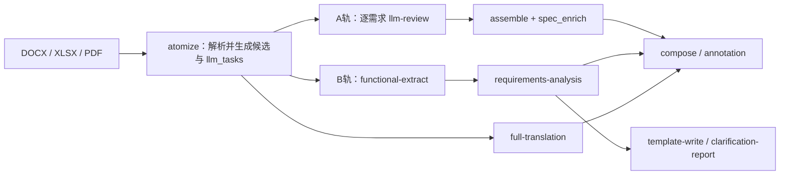

# Requirement Atomizer 仓库架构与 Token 成本审计报告

**报告日期：** 2026-08-16  
**审查对象：** `requirement-atomizer-vue3` 当前工作树  
**审查范围：** 目录结构、核心组件、技术栈、运行流程、AI 实现、缓存与预算、重复职责及 token 放大路径  
**审查性质：** 静态代码与现有运行产物审计；本报告未修改业务代码，未执行回归测试

## 1. 执行摘要

当前仓库已经形成较完整的技术标准解析、需求抽取、专家评审、声明闭环和交付物生成能力，但架构复杂度已超过现有平铺式组织方式的承载范围。

本次审计的核心结论是：当前 token 消耗异常高，并非由某一个 prompt 或模型参数单独导致，而是以下因素叠加形成的系统性乘法效应：

> **A/B 双轨重复执行 × 逐需求工具循环 × 全文翻译自动执行 × 降级重试 × 粗粒度缓存失效 × 默认无文档总预算**

最严重的问题有四项：

1. 开启 LLM 后，UI 默认同时执行 A 轨原子审查和 B 轨功能需求直抽，两套付费链路没有共享主要结果。
2. 全文翻译没有独立 UI 开关，只要启用 LLM 就自动加入运行链。
3. 文档级统一 token/call 预算已经实现，但默认关闭。
4. 阶段编排、LLM 执行和付费缓存存在多份实现，导致重复判断、行为漂移和无谓重跑。

仓库中的真实预算产物进一步验证了问题规模：

- 样本：`out/sbd-full-translation-v5-acceptance-360-20260811/llm_budget.json`
- 单独 `full_translation` 阶段调用数：**345 calls**
- 单独 `full_translation` 阶段 token：**1,048,945 tokens**

因此，优先治理方向不是继续压缩单个 prompt，而是先改变默认运行链、启用总预算、细化缓存粒度，并建立唯一的编排与 LLM 执行框架。

## 2. 审查基线与方法

### 2.1 审查基线

- 顶层 Python 模块：129 个
- 测试 Python 模块：204 个
- `CLAUDE.md`：224,718 bytes，约 1,021 行
- 当前工作树存在用户已有改动：
  - `functional_extract.py`
  - `prompt_registry.py`
- 本报告没有回滚、覆盖或修改上述文件。

### 2.2 审查方法

本次审查主要覆盖：

- `AGENTS.md`、`CLAUDE.md`、`ARCHITECTURE.md`
- `pyproject.toml`、`config.py`
- `atomize.py`、`cli.py`、`desktop_tasks.py`、`api_server.py`
- `llm_client.py`、`llm_pipeline.py`、`ai_extract.py`
- `functional_extract.py`、`spec_enrich.py`、`requirements_analysis.py`
- `doc_annotation_export.py`、`full_translation.py`
- `claim_artifacts.py`、`claim_ledger.py` 及相关 review/claim 模块
- `ui/src/App.vue` 及 Electron/Vue 运行桥接逻辑
- 仓库现有 `out/` 预算和验收产物

## 3. 目录与代码组织

### 3.1 当前组织方式

仓库采用“顶层模块为主、局部 package 为辅”的平铺结构：

```text
requirement-atomizer-vue3/
├── *.py                    # 129 个顶层业务/编排/存储模块
├── parsers/                # DOCX/XLSX/PDF 解析辅助实现
├── requirement_kb/         # 需求知识库能力
├── llm_agents/             # LLM pipeline YAML 配置
├── gui/                    # 冻结的 PySide6 GUI
├── ui/                     # Vue 3 + Electron 主界面
├── schemas/                # JSON Schema
├── docs/                   # 设计、验收、评审与历史说明
├── tests/                  # unittest 测试
├── golden_sets/            # 冻结回归基线
└── out/                    # 本机运行结果与 golden 对照产物
```

### 3.2 复杂度集中点

当前部分模块已经同时承担编排、领域逻辑、文件 I/O、兼容处理和状态投影：

| 文件 | 当前行数 | 主要职责 |
|---|---:|---|
| `claim_artifacts.py` | 6,209 | claim 发布、验证、投影、产物生成等 |
| `ui/src/App.vue` | 6,210 | UI、运行配置、链路规划、进度状态、评审交互 |
| `ai_extract.py` | 4,827 | prompt、调用、校验、自检、缓存、批处理 |
| `claim_ledger.py` | 4,566 | claim 账本、闭环、状态与一致性处理 |
| `desktop_tasks.py` | 3,701 | Electron bridge、阶段编排、缓存指纹、manifest、CLI |
| `api_server.py` | 3,425 | HTTP 路由、状态读取、评审与维护操作 |

这些模块的职责边界已经不再清晰。新增功能通常只能继续叠加条件分支和版本戳，进一步扩大修改影响范围。

### 3.3 结构漂移

1. `parsers/base.py` 定义了 `DocumentParser -> DocumentIR` 抽象，但生产 `atomize` 主路径仍按文件扩展名直接调用 `extract_docx`、`extract_xlsx`、`extract_pdf`。
2. `pyproject.toml` 手工维护的 `py-modules` 列表中存在 `doc_map`、`reconcile`、`adjudicate` 重复登记。
3. `ARCHITECTURE.md:39` 仍声明 functional extract 默认关闭，但 `config.py:75` 已默认开启。
4. `gui/` 与 `ui/` 同时存在，但只有 `ui/` 是当前主 GUI，旧 `gui/` 只能通过约束避免误扩展。

## 4. 核心组件与技术栈

### 4.1 后端技术栈

- Python 3.11+
- `python-docx`：DOCX 解析和生成
- `openpyxl`：XLSX 解析和需求表生成
- `pdfplumber`：PDF 文本与几何解析
- `jsonschema`：结果包与中间产物校验
- `PyYAML`：LLM pipeline、prompt 和领域配置
- `ThreadingHTTPServer`：本地 review API
- JSON、JSONL、XLSX、WAL：主要持久化方式

系统没有数据库。状态通过多个 append-only JSONL、快照 JSON、锁文件和原子替换维护。

### 4.2 前端与桌面层

- Vue 3
- TypeScript
- Vite
- Naive UI
- Electron
- Vitest

Electron 通过 `desktop_tasks.py` 调用 Python 后端任务；Vue 页面同时维护运行阶段配置、计划阶段、实际状态和任务进度。

### 4.3 LLM 技术栈

- 自行使用 `urllib` 实现 OpenAI-compatible HTTP client
- 默认模型路由由 YAML 和环境变量共同配置
- 支持普通 JSON 调用和带工具的 bounded tool-loop
- 支持调用级 trace、阶段缓存、usage 统计和可选文档预算账本
- 未使用 OpenAI 官方 SDK或统一的第三方 agent runtime

## 5. 当前运行流程

### 5.1 两条主要业务轨道

**A 轨：原子化与 DLMS/COSEM 实现规格**

```text
atomize
  -> atomic_candidates / llm_tasks
  -> llm-review
  -> assemble
  -> spec_enrich
  -> compose / annotation
```

**B 轨：功能需求直抽与软件需求成文**

```text
atomize
  -> functional-extract
  -> requirements-analysis
  -> template-write
  -> clarification-report
```

根据仓库约束，B 轨主要面向 prose/tender 文档，A 轨主要面向 DLMS profile 和结构化标准文档。

### 5.2 开启 LLM 后的真实默认链



关键事实：

- `ui/src/App.vue:927-933` 将 `llmReview`、`aiExtract`、`assemble`、`analyze`、`compose`、`annotationHtml` 全部默认设为 `true`。
- `ui/src/App.vue:2096` 在 LLM 模式下无条件加入 `full-translation`。
- `desktop_tasks.py:2676-2686` 将 UI 传入的 `ai-extract + functional-synthesis` 替换为 `functional-extract`。
- 替换不会取消此前单独执行的 `llm-review`。
- `desktop_tasks.py:2718` 仍将 LLM route 传入 `assemble/spec_enrich`。

因此，默认链不是简单的 A/B 切换，而是 A 轨审查、B 轨抽取、A 轨富化和全文翻译同时存在。

## 6. AI 实现方式

### 6.1 LLM Review

`llm_pipeline.py` 对每条需求单独运行带工具的 review loop：

- 默认 token budget：20,000 / requirement
- 默认最大轮次：5
- 工具：KB 搜索、KB 条目读取、Blue Book class、原文读取、coverage 检查
- tool-loop 路径不能进行普通合批
- schema repair 会消耗剩余轮次并再次调用模型

理论预算近似为：

```text
LLM review 最大 token ≈ 原子需求数量 × 20,000
```

该值还不包含 functional extract、spec enrich、requirements analysis 和全文翻译。

### 6.2 Functional Extract

当前默认启用 `functional-extract`，替代旧 `ai-extract + functional-synthesis`：

- `legacy` 策略：把全部条款组合进一次文档级 prompt，每条文本截断至 4,000 字符。
- `clause_family` 策略：按目标条款逐包调用，并附带邻近条款和 doc map 摘要。
- 结果执行确定性 guard、守恒检查和来源验证。
- 缓存 fingerprint 包含全部 clauses，最终缓存整个文档 payload。

即使使用 `clause_family` 逐条款调用，外围缓存仍是文档级；任意条款变化都可能使全部包重新执行。

### 6.3 Requirements Analysis 与 Spec Enrich

两个模块分别实现了：

- prompt 构建
- 合批调用
- 缺槽检测
- 单条重试
- JSON 映射与修复
- 缓存读取和追加
- fast-fail 与并发调度

`spec_enrich.py` 已在注释中明确描述其批处理逻辑是 `llm_pipeline` 的镜像，说明重复已经被代码自身识别，但尚未抽象治理。

### 6.4 全文翻译

全文翻译采用多级恢复策略：

1. 按数量和字符数进行贪心装包。
2. 批次 JSON 非法时递归拆半，最多两轮。
3. 批次缺条或校验漂移时单条重试。
4. 单条仍失败时将文本切成句段逐个调用。
5. 通过 sidecar journal 保存翻译结果和恢复状态。

该策略适合最终高质量交付，但不适合作为每次普通运行的默认阶段。

## 7. Token 异常高的根因

### 7.1 默认双轨重复付费

严重度：**P0**

打开 LLM 后，默认同时发生：

```text
A轨 llm-review
+ B轨 functional-extract
+ A轨 spec_enrich
+ B轨 requirements-analysis
+ full_translation
```

B 轨 functional extract 不消费 A 轨 `llm_review_results`。两条链路虽然共享解析产物，但没有共享最昂贵的模型判断。

### 7.2 全文翻译隐式开启

严重度：**P0**

UI 的 `RunStages` 类型没有 `fullTranslation` 字段，用户无法通过与其他阶段一致的开关控制它。只要 `useLlm=true`，计划阶段和实际阶段都会加入全文翻译。

现有真实样本已经证明，该阶段可以独立消耗超过 100 万 token。

### 7.3 文档总预算默认关闭

严重度：**P0**

`RATOMIZER_LLM_BUDGET` 默认值为 `0`。在关闭状态下：

- 各阶段仍有自己的局部轮次或 batch 限制。
- 但不存在覆盖所有阶段的文档总 calls/token 硬上限。
- 一个阶段的超支不会阻止后续阶段继续付费。

### 7.4 阶段指纹包含无关配置

严重度：**P1**

`desktop_tasks.stage_input_fingerprint` 将以下配置统一放入指纹载荷：

- AI self-check
- AI verify
- review batch
- analyze batch
- enrich batch
- translate batch
- functional extract 开关

结果是修改某个阶段的调优参数时，其他阶段也可能失去复用资格。例如调整翻译 batch size 不应导致 atomize、functional extract 或 assemble 重跑。

### 7.5 Functional Extract 缓存粒度过粗

严重度：**P1**

当前指纹包含全部 clauses，缓存值包含整个 `functional_requirements.json` payload。局部修改、定点重抽或单条款修复无法自然复用其他未变化条款的付费结果。

### 7.6 多套 LLM 调度与缓存实现

严重度：**P1**

下列模块分别实现了相似的调用基础设施：

- `llm_pipeline.py`
- `ai_extract.py`
- `spec_enrich.py`
- `requirements_analysis.py`
- `doc_annotation_export.py`

它们对以下问题采用不同策略：

- 并发与 fast-fail
- 缺槽重试
- JSON repair
- cache fingerprint
- 缓存追加
- usage 统计
- 降级和失败状态

这会导致同类错误在不同阶段产生不同的调用倍增行为，也使统一成本治理难以实现。

### 7.7 付费缓存写入不统一

严重度：**P1**

`spec_enrich.append_cache` 和 `ai_extract.append_cache` 仍使用裸 `path.open("a")`。它们没有完整复用仓库对共享状态文件要求的：

- 跨进程锁
- 临时文件
- flush + fsync
- `os.replace`
- Windows `PermissionError` retry

缓存尾部撕裂、并发覆盖或部分写入可能使下次运行无法命中缓存，从而再次支付模型费用。

### 7.8 编排逻辑存在多份真相

严重度：**P1**

目前至少存在四个阶段定义来源：

1. Vue `plannedAutomaticStages`
2. Vue 实际提交给 bridge 的 stages
3. Python `CHAIN_ORDER` 和 functional extract 替换规则
4. `ratomizer run` CLI 的固定执行语义

计划展示、结果包声明、后端实际运行和命令行运行之间可能出现漂移。

### 7.9 Agent 上下文成本过高

严重度：**P2**

`AGENTS.md` 要求非平凡任务先读取 `CLAUDE.md`。但 `CLAUDE.md` 已成为 224KB 的追加式历史决策日志，其中同时包含：

- 当前有效约束
- 已被后续实现覆盖的历史结论
- 具体测试结果
- 分支和日期状态
- 大量版本戳说明

这会让每一次开发 agent 都重复消费大量上下文 token，并增加被旧信息误导的概率。

## 8. 风险排序

| 优先级 | 问题 | 直接影响 |
|---|---|---|
| P0 | A/B 双轨默认同时执行 | 重复模型判断与富化 |
| P0 | 全文翻译隐式开启 | 单文档可额外消耗百万级 token |
| P0 | 文档预算默认关闭 | 缺少总成本熔断 |
| P1 | 全局化阶段指纹 | 无关配置变化触发付费重跑 |
| P1 | Functional Extract 文档级缓存 | 局部变化导致全量重跑 |
| P1 | 多套 LLM runner | 重试、统计和降级行为不一致 |
| P1 | 裸 append 付费缓存 | 缓存损坏后重复付费 |
| P1 | 四份编排真相 | UI、CLI、manifest 和实际运行漂移 |
| P2 | 平铺模块和超大文件 | 修改影响面与理解成本持续上升 |
| P2 | 历史上下文无限增长 | 开发 agent token 和误判风险上升 |

## 9. 建议的目标架构

### 9.1 PipelinePlan：唯一编排真相源

建议由 Python 后端生成规范化 `PipelinePlan`：

```json
{
  "profile": "b_track",
  "stages": [
    {"name": "atomize", "paid": false},
    {"name": "functional-extract", "paid": true},
    {"name": "requirements-analysis", "paid": true},
    {"name": "template-write", "paid": false}
  ],
  "estimated_calls": 42,
  "estimated_tokens": 380000,
  "budget": {"max_calls": 60, "max_tokens": 500000}
}
```

UI、CLI、Electron bridge、result package 和 run manifest 全部消费同一份计划，不再各自推导 stages。

### 9.2 文档 Profile

建议提供三个明确 Profile：

| Profile | 适用场景 | 默认付费链 |
|---|---|---|
| `b_track` | prose、tender、软件需求成文 | functional extract + analysis |
| `a_track` | DLMS profile、结构化标准 | atom review + assemble |
| `hybrid_audit` | 正式交叉审计 | A/B 双轨，显式授权 |

全文翻译不属于任何普通 Profile 的隐式步骤，应作为最终交付选项单独开启。

### 9.3 LLMJobRunner

统一模型调用基础设施应负责：

- route 和 model 解析
- 文档级和阶段级预算扣减
- 并发、超时和熔断
- JSON/schema 校验与有限修复
- retry 分类和最大放大系数
- usage 与 provenance 记录
- cache lookup/write
- progress event
- failed/partial/ok 统一状态

各业务模块只提供：

- 输入单元
- prompt operation
- schema
- deterministic guard
- 合并函数

### 9.4 PaidCacheStore

所有付费结果缓存统一使用：

- versioned namespace
- 单元级 fingerprint
- process lock
- append WAL 或原子快照
- fsync
- Windows replace retry
- torn-tail recovery
- cache hit/miss usage 统计

### 9.5 建议的 package 边界

```text
ratomizer/
├── core/                   # ID、hash、schema、result package、公共模型
├── parsing/                # DOCX/XLSX/PDF -> 统一 IR
├── pipelines/
│   ├── a_track/            # atomize、review、assemble
│   └── b_track/            # functional extract、analysis、template
├── llm/
│   ├── client.py
│   ├── runner.py
│   ├── budget.py
│   ├── cache.py
│   └── tools/
├── review/
│   ├── claims/
│   ├── actions/
│   └── projections/
├── delivery/               # translation、compose、annotation、facsimile
├── platform/
│   ├── api/
│   ├── desktop/
│   └── cli/
└── compatibility/          # legacy output、旧 GUI、旧 schema 读取
```

该拆分应采用渐进迁移，不应一次性移动全部顶层模块或同时改动行为版本。

## 10. 分阶段治理计划

### 第一阶段：立即止血，建议 1-3 天

1. UI 增加 A/B/Hybrid Profile，并让 A、B 普通模式互斥。
2. 增加 `fullTranslation` 独立开关，默认关闭。
3. 将 `RATOMIZER_LLM_BUDGET` 的产品默认切为开启。
4. 运行前展示预计阶段、calls、tokens 和最大重试放大系数。
5. 对现有样本文档分别记录 A、B、Hybrid 三个 Profile 的真实 usage。

预期收益：立即消除大部分无意双轨调用；仅关闭默认全文翻译，在现有样本上即可避免约 105 万 token。

### 第二阶段：缓存与调用框架，建议 1-2 周

1. 将阶段指纹改为按阶段声明 `config_dependencies`。
2. 将 functional extract 改为条款级缓存、文档级合并。
3. 抽取统一 `PaidCacheStore`，先迁移 `spec_enrich` 和 `ai_extract`。
4. 抽取 `LLMJobRunner`，先覆盖普通 JSON batch 调用。
5. 为翻译设置文档级 calls/token 子预算和最大 retry amplification。

### 第三阶段：编排统一，建议 2-4 周

1. 实现后端 `PipelinePlan`。
2. UI 删除本地重复 stage 推导，只展示后端计划。
3. CLI、Electron chain 和 result package 使用相同计划。
4. 将 stage contract、输入文件、配置依赖和生产者版本声明化。
5. 增加“计划与实际运行一致性”自动测试。

### 第四阶段：结构拆分，持续推进

1. 先拆 `desktop_tasks.py` 的 manifest、fingerprint、chain executor。
2. 再拆 `App.vue` 的运行配置、任务状态和 review 页面域。
3. 将 claim 读取、写入、projection 和发布职责拆成独立 package。
4. 建立统一 Document IR，让生产解析主路径真正消费 parser interface。
5. 将 `CLAUDE.md` 压缩为当前状态摘要和按月 ADR/历史档案。

## 11. 验收指标

治理不能只以“代码变少”为完成标准，建议持续记录以下指标：

| 指标 | 建议目标 |
|---|---:|
| 普通 B 轨运行是否触发 A 轨调用 | 0 次 |
| 非最终交付运行是否触发全文翻译 | 0 次 |
| 文档总预算覆盖率 | 100% 真实 LLM 调用 |
| 单条款变更后的 functional extract 重跑比例 | 仅变化条款及必要邻居 |
| 无关配置变化导致的阶段 cache miss | 0 |
| 付费缓存裸 append 实现 | 0 处 |
| UI/CLI/backend 阶段计划来源 | 1 个 |
| 每文档 calls/token 可追踪率 | 100% |
| `CURRENT_STATE.md` 建议大小 | 5-10KB |

同时必须保证：

- anti-hallucination 红线不降低；
- stub 不伪装为真实 LLM 产物；
- provenance 不因缓存合并而失真；
- A/B Profile 切换只改变执行链，不改变相同阶段内部语义；
- 所有行为版本变更继续执行 golden 回归和结果包再生成流程。

## 12. 最终结论

仓库当前的主要矛盾不是“功能太多”，而是功能已经形成多个成熟子系统，却仍被放在同一个平铺模块空间、同一个大型 UI 文件和多份编排逻辑中管理。

Token 治理的正确优先级应为：

```text
先消除默认重复链路
  -> 再建立文档总预算
  -> 再修复缓存粒度和指纹依赖
  -> 再统一 LLM runner 与付费缓存
  -> 最后推进 package 级结构拆分
```

若只继续压缩 prompt，而不改变默认双轨、全文翻译和缓存失效机制，token 成本只会获得局部改善，无法消除异常波动。

