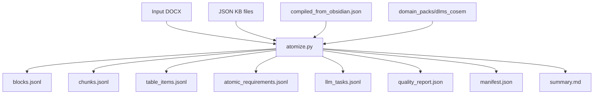
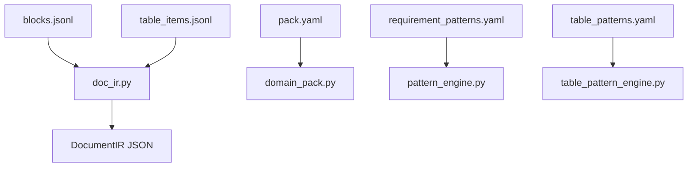
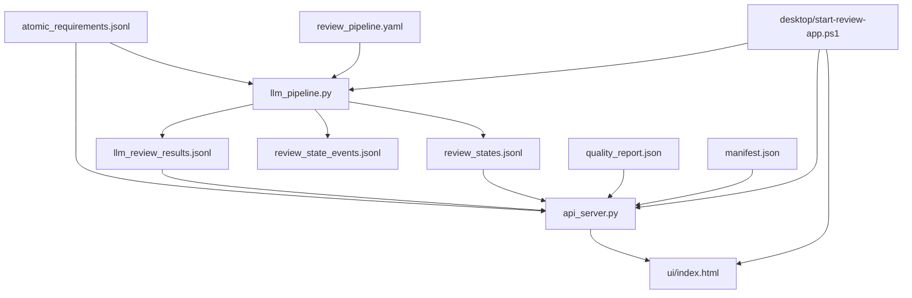
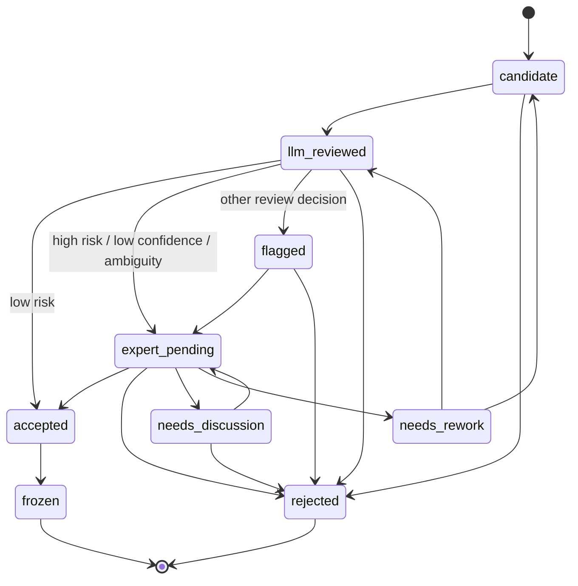
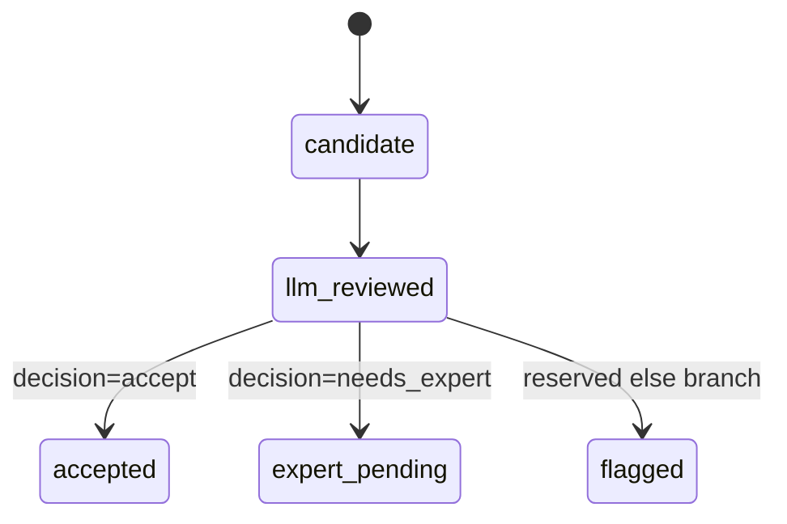
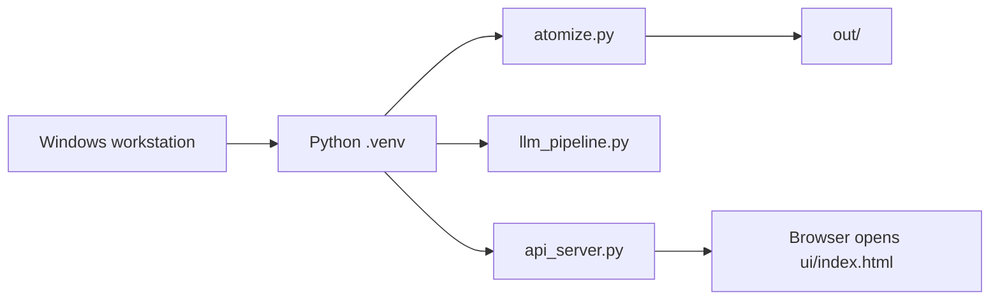

# Requirement Atomizer 技术平台概要设计

> 面向专家评审的概要设计稿。本文描述当前仓库在 `f4e00fd` 后形成的平台层能力、模块边界、数据契约、部署模型、风险点与后续演进计划。

## 0. 专家意见响应摘要

### 0.1 第一轮评审意见

| 优先级 | 改进项 | 本次文档处理 |
| --- | --- | --- |
| 高 | 补充 `atomic_requirements.jsonl` 的 schema 和样例数据 | 已在第 5 节补充当前字段契约、JSON Schema 草案和三类样例 |
| 高 | 修正 domain pack 10 vs 5 patterns 的不一致 | 已在第 4.3 节明确区分 capability 声明数量与已落地 seed pattern 数量 |
| 高 | 补充包结构和部署模型说明 | 已在第 3 节和第 9 节补充 |
| 中 | 拆分 `atomize.py` 的具体拆分计划 | 已在第 10.3 节补充分阶段拆分计划 |
| 中 | 补充错误处理与容错策略 | 已在第 8 节补充 |
| 中 | 状态机异常路径描述 | 已在第 7.3 节补充 |
| 中 | 拆分 mermaid 架构图 | 已拆分为第 2 节三张小图 |
| 低 | 术语表 | 已在第 12 节补充 |
| 低 | 性能预估 | 已在第 11 节补充单文档场景下的性能考量与基准计划 |

### 0.2 第二轮评审意见

| 优先级 | 改进项 | 本次文档处理 |
| --- | --- | --- |
| 高 | 状态机遗漏 `flagged` 和部分 rejected 转移 | 已按 `review_state.py VALID_TRANSITIONS` 重画第 7 节状态图 |
| 高 | `pack.yaml.review_policy` 与 `llm_agents/review_pipeline.yaml.risk_policy` 双配置未说明 | 已在第 4.3、10.4、14、15 节明确双配置来源；代码侧已让 `llm_pipeline.py` 合并 domain pack review policy |
| 高 | `mandatory_review_types` 未生效且 `cosem_attribute_access` 可能被 stub 自动 accepted | 已在第 4.3 和第 14 节更新现状；代码侧已让 mandatory review 类型进入专家审核 |
| 高 | `condition` 字段说明不准确 | 已在第 5.1 和第 14 节说明当前所有规则候选均为 `None` |
| 高 | `pack.yaml.runtime_contract` 是第三份契约且含 future fields | 已在第 5.2 和第 10.4 节说明 single source of truth 方案与 `pattern_id` 追溯价值 |
| 中 | 本地 API CORS 为 `*` 且无鉴权 | 已在第 8、9、14、15 节更新为本地 origin allowlist + 可选 token 的当前实现，并保留写入端点前置加固要求 |
| 中 | `req_id` 跨 run 不稳定 | 已在第 5.1、10.2、14、15 节补充稳定 ID 风险与建议 |
| 中 | `gap_find` 声明消费 `llm_task`，但 stub 当前不读 `llm_tasks.jsonl` | 已在第 6.2、14、15 节补充当前/设计差异 |
| 中 | `/requirements` 返回 enriched 数据且 limit 默认 50 | 已在第 4.6 节补充 |
| 低 | 包结构树漏列 legacy/utility 文件和依赖文件 | 已在第 3 节补充 `extract_terms.py`、`extract_cosem_instances.py`、`requirements.txt`、`out/` |
| 低 | 缺版本头 | 已补充 `document_version`、`review_status`、`code_anchor`、`updated_at` |
| 低 | “性能预估”标题不准确 | 已改为“性能考量与基准计划” |

### 0.3 第三轮代码架构评审意见

| 优先级 | 改进项 | 本次文档处理 |
| --- | --- | --- |
| 高 | golden regression 依赖既有 `out/` 产物，不是真正回归 | 已提升为第 10.1 节 Phase 0 前置工作；代码侧新增最小 DOCX fresh pipeline regression，并抽出 `run_atomizer_pipeline()` 供 CLI 和测试共用 |
| 高 | 平台层尚未进入生产路径，`atomize.py` 仍是唯一承重入口 | 已在第 10 节明确 Phase 0 后才进入拆分和平台接线，避免在没有回归防线时重构 |
| 高 | `req_id` 不稳定且 `review_states.jsonl` 会被整文件覆盖 | 已将稳定 ID 与 append-only 状态存储提前到第 10.2 节，作为写入型专家审核工作台前置条件 |
| 中 | `pack.yaml.review_policy` 与实际 runtime risk policy 脱节 | 已接入 runtime 策略合并；第 10.4 保留 single source of truth 收敛任务 |
| 中 | 工程化地基薄，包括打包、schema runtime validation、CWD import | 已新增 `pyproject.toml`、`schemas/atomic_requirement.schema.json`、`llm_review_schema.py` 和轻量 runtime validation；包目录迁移仍保留在第 10.7 |

文档版本信息：

```text
document_version: 0.6
review_status: third expert review engineering fixes applied locally
code_anchor: f4e00fd + local regression, identity, review-policy, schema validation, packaging, and API security changes
updated_at: 2026-06-10
```

## 1. 背景与目标

Requirement Atomizer 最初定位是将技术标准 `.docx` 文档拆解成结构化块、检索片段、表格行记录和 LLM 任务。当前版本在原有 atomizer 基础上新增平台层，目标是把“标准文档解析”扩展为“需求候选抽取、知识库匹配、规则生成、模型审核、专家审核和本地展示”的闭环工具链。

平台当前重点服务 DLMS/COSEM 智能电表标准文档，尤其是 ABNT NBR 16968:2022 这类大量需求隐藏在协议章节、对象定义和表格矩阵中的文档。

本阶段目标：

- 保持 `atomize.py` 当前运行输出稳定。
- 将 DOCX 解析结果沉淀为可迁移的 Document IR。
- 将 DLMS/COSEM 表格与需求模式逐步迁移为 domain pack 配置。
- 生成可审核的 rule-based atomic requirement candidates。
- 提供 LLM/stub 审核管线、专家审核状态机和本地 API/UI 壳。
- 为后续 PDF、Excel、Markdown、HTML 解析器和真实 LLM worker 接入预留接口。

非目标：

- 当前不直接替代专家审核。
- 当前不承诺自动生成最终合规需求。
- 当前 LLM 审核层仍是 stub/local-rule-reviewer，不是真实模型集成。
- 当前 UI 是本地静态 review shell，不是完整产品化桌面应用。

## 2. 总体架构

为提高评审可读性，整体架构拆成三张图：抽取层、审核层、展示层。

### 2.1 抽取与知识匹配层



该层负责确定性解析、知识库匹配、表格增强和规则候选生成。它不负责最终裁决需求是否成立。

### 2.2 中间表示与规则配置层



该层用于降低平台对 DOCX 和硬编码 DLMS/COSEM 逻辑的绑定。当前仍处于迁移期，`atomize.py` 是运行时主入口。

### 2.3 审核与展示层



该层负责风险分类、审核状态输出、本地 API 和静态 UI 展示。当前 API/UI 以只读评审为主。

## 3. 包结构说明

当前仓库按职责可以分为以下包或目录：

```text
requirement-atomizer/
  atomize.py                         # 当前主抽取入口，仍承载核心 DOCX 解析和规则候选生成
  doc_ir.py                          # Document IR 数据结构
  doc_ir_export.py                   # Document IR 导出 CLI
  atomic_requirement_schema.py        # atomic_requirements JSONL 轻量校验器
  parsers/                           # 解析器接口和 DOCX bridge
    base.py
    docx_parser.py
  domain_pack.py                     # domain pack manifest 加载器
  domain_packs/dlms_cosem/           # DLMS/COSEM 领域配置
    pack.yaml
    kb_sources.yaml
    requirement_patterns.yaml
    table_patterns.yaml
  pattern_engine.py                  # requirement pattern 渲染与匹配
  table_pattern_engine.py            # table pattern 匹配
  output_writer.py                   # JSONL/manifest/quality report/summary 输出工具
  extract_terms.py                   # legacy/utility: 从 atomizer 输出提取候选术语
  extract_cosem_instances.py         # legacy/utility: 从 table_items 提取 COSEM 对象实例
  knowledge_bases/                   # 运行时 JSON 知识库
  obsidian-vault/                    # 人工维护知识库源
  requirement_kb/                    # reusable KB package: repository, matching, schema, Obsidian compiler, vault validator, CLI, server
  llm_pipeline.py                    # 当前 stub 审核管线
  llm_review_schema.py               # llm_review_results JSONL 轻量校验器
  llm_agents/review_pipeline.yaml    # 审核管线配置
  review_state.py                    # 专家审核状态机
  api_server.py                      # 本地只读 API
  ui/index.html                      # 静态审核界面
  desktop/start-review-app.ps1       # Windows 本地启动脚本
  schemas/                           # JSON schema
    atomic_requirement.schema.json
    kb_schema.json
    llm_review_result.schema.json
    test_point.schema.json
  golden_sets/                       # golden regression baseline
  out/                               # 本地运行输出目录，默认不进入版本库
  pyproject.toml                     # Python 项目元数据、依赖和 CLI scripts
  requirements.txt                   # Python 运行依赖
  tests/                             # 单元与回归测试
```

关键边界：

- `atomize.py` 是当前生产输出入口。
- `doc_ir.py` 是后续多格式解析统一目标。
- `domain_packs/dlms_cosem` 是规则配置化迁移目标。
- `llm_pipeline.py` 当前只是 stub，真实 LLM worker 未来应作为可替换实现接入。
- `api_server.py` 当前只读，不承担审核写入。

## 4. 核心模块职责

### 4.1 文档解析与候选抽取

主入口：`atomize.py`

主要职责：

- 读取 DOCX 文档。
- 输出结构化 blocks、chunks、table_items。
- 将表格中的矩阵、访问权限、COSEM 对象、事件、计量量、security policy 等转换为结构化行记录。
- 生成 rule-based `atomic_requirements.jsonl`。
- 生成 `quality_report.json`，统计覆盖率、低置信度、歧义和需求类型分布。
- 生成 `llm_tasks.jsonl`，为后续模型审核提供任务输入。

关键输出：

```text
blocks.jsonl
chunks.jsonl
table_items.jsonl
atomic_requirements.jsonl
llm_tasks.jsonl
quality_report.json
manifest.json
summary.md
```

当前 golden baseline 显示 ABNT NBR 16968 v5 输出规模：

```text
blocks: 1013
chunks: 366
table_items: 2075
atomic_requirements: 2337
llm_tasks: 2394
cosem_object_instances: 363
```

### 4.2 Document IR 层

模块：

```text
doc_ir.py
doc_ir_export.py
parsers/base.py
parsers/docx_parser.py
```

Document IR 是平台中间表示，当前结构包括：

```text
DocumentIR
-> BlockIR
-> TableIR
-> Provenance
```

设计意图：

- 将后续 agent 和审核层从 DOCX 细节中解耦。
- 为 PDF、Excel、Markdown、HTML 等解析器提供统一目标结构。
- 通过 provenance 保存来源格式、源路径、block_id、table_id、row_id 等追溯信息。

当前 `parsers/docx_parser.py` 是第一版 DOCX bridge，主要用于把现有 atomizer 输出转换为 Document IR，而不是重写解析器。

### 4.3 Domain Pack 与模式引擎

模块：

```text
domain_pack.py
domain_packs/dlms_cosem/pack.yaml
domain_packs/dlms_cosem/kb_sources.yaml
domain_packs/dlms_cosem/requirement_patterns.yaml
domain_packs/dlms_cosem/table_patterns.yaml
pattern_engine.py
table_pattern_engine.py
```

domain pack 用于将领域能力配置化。当前 `dlms_cosem` pack 声明：

- 支持的文档领域：energy_metering、smart_meter、dlms_cosem。
- 知识库来源：三个 seed KB 和 `compiled_from_obsidian.json`。
- 审核策略：`pack.yaml` 声明默认 candidate、mandatory review types 和 high risk types；当前 `llm_pipeline.py` 会通过 `--domain-pack` 将 `pack.yaml.review_policy` 合并进 runtime risk policy。`llm_agents/review_pipeline.yaml` 仍保留 pipeline 默认风险策略，两者后续应收敛为更清晰的 single source of truth。
- 表格能力 category：`pack.yaml` 中声明 7 类 table pattern capability。
- 需求能力 category：`pack.yaml` 中声明 10 类 requirement pattern capability。

需要特别澄清的数量口径：

```text
pack.yaml requirement pattern capabilities: 10
requirement_patterns.yaml implemented seed patterns: 5

pack.yaml table pattern capabilities: 7
table_patterns.yaml implemented concrete seed patterns: 11
```

这不是同一维度的数量：

- `pack.yaml` 的 10 个 requirement pattern capabilities 是目标能力清单。
- `requirement_patterns.yaml` 当前只落地了 5 个可执行 seed requirement patterns。
- `pack.yaml` 的 7 个 table pattern capabilities 是抽象能力分类。
- `table_patterns.yaml` 当前落地了 11 个具体 table pattern seed，其中多个 seed 可归入同一抽象分类。

当前已落地的 5 个 requirement seed patterns：

```text
cosem_attribute_access
cosem_object_instance
event_definition
measurement_quantity_unit
security_policy_bit
```

当前尚未在 `requirement_patterns.yaml` 落地，但在 `pack.yaml` 能力清单中声明的 5 个 requirement capabilities：

```text
event_group_retention
security_suite_definition
security_policy_state
association_security_matrix
flag_definition
```

这些能力目前仍主要由 `atomize.py` 的硬编码逻辑覆盖。后续配置化时应把它们迁移到 `requirement_patterns.yaml`。

当前 `atomize.py` 仍是运行时输出的 source of truth。domain pack 是迁移桥梁，不应被误解为所有 DLMS/COSEM 规则已经完成配置化。

风险策略当前存在双配置源：

```text
domain_packs/dlms_cosem/pack.yaml
  review_policy.mandatory_review_types
  review_policy.high_risk_types

llm_agents/review_pipeline.yaml
  risk_policy.high_risk_types
  risk_policy.low_confidence_threshold
```

当前运行时通过 `llm_pipeline.py merge_review_policy()` 合并 `llm_agents/review_pipeline.yaml.risk_policy` 与 `pack.yaml.review_policy`。合并后：

- `mandatory_review_types` 优先级高于 `high_risk_types` 和低置信度判断。
- mandatory review 类型被分类为 `mandatory_review`，stub decision 为 `needs_expert`。
- `mandatory_review` 复用 high-risk model route。

需要特别注意：`pack.yaml` 将 `cosem_attribute_access` 列入 `mandatory_review_types`，而它在 golden baseline 中为 1425 条，占 2337 条候选的约 61%。接入 mandatory review 后，这类候选不再被 stub 自动推进到 `accepted`；但两份配置仍有漂移风险，后续应把策略来源收敛到更明确的单一契约。

### 4.4 知识库层

模块：

```text
knowledge_bases/*.json
obsidian-vault/
requirement_kb/
schemas/kb_schema.json
```

知识库采用两层形态：

- 主维护层：`obsidian-vault/`
- 运行时层：JSON KB，例如 `knowledge_bases/compiled_from_obsidian.json`

新增校验能力分为两类：

- `requirement_kb.vault`：检查 Obsidian 笔记字段、重复 ID、metadata JSON、relations 目标等。
- `requirement_kb.schema`：检查编译后的 JSON KB 是否满足 portable KB contract。

知识库在 atomizer 中通过 `--kb` 挂载，匹配结果会进入 blocks、chunks、table_items 和 llm_tasks，支撑后续需求识别与上下文补全。

### 4.5 LLM/专家审核层

模块：

```text
llm_pipeline.py
llm_agents/review_pipeline.yaml
review_state.py
schemas/llm_review_result.schema.json
schemas/test_point.schema.json
```

当前 review pipeline 定义了以下操作：

- classify_risk
- correct_errors
- merge_duplicates
- gap_find
- test_point_generate

当前实现是 stub reviewer：

- 高风险类型、低置信度或有歧义的需求进入 `needs_expert`。
- 低风险需求进入 `accept`。
- 其他非 `needs_expert` / `accept` 的决策预留进入 `flagged`，当前 stub 默认不会触发该分支。
- 写出 `llm_review_results.jsonl` 前会调用 `llm_review_schema.py` 做轻量 runtime validation，防止后续真实 LLM worker 输出非法 decision、confidence 或错误字段类型。
- 输出 `llm_review_results.jsonl`、`review_states.jsonl` 和追加式 `review_state_events.jsonl`。

### 4.6 API、UI 与 Windows 启动壳

模块：

```text
api_server.py
ui/index.html
desktop/start-review-app.ps1
```

本地 API 读取 atomizer 输出目录中的 JSON/JSONL 文件，提供只读查询：

```text
GET /health
GET /manifest
GET /quality
GET /requirements?limit=100&type=cosem_attribute_access
GET /reviews?limit=100
GET /review-states?status=expert_pending
GET /review-summary
```

`/requirements` 端点并非只返回原始 `atomic_requirements.jsonl` 行。它会通过 `enrich_requirements()` 将同一需求对应的 `review` 和 `review_state` 内联到每条需求中，这是当前静态 UI 展示审核结果的关键依赖。当前 enrichment 同时支持 `stable_req_id`、`requirement_id` 和兼容用 `req_id`，优先服务稳定身份迁移。该端点的 `limit` 默认值为 50，文档示例使用 100 只是调用方显式传参。

`ui/index.html` 是静态 review dashboard，用于查看质量摘要、需求候选、review decision 和 review state。

`desktop/start-review-app.ps1` 用于：

- 可选运行 `llm_pipeline.py`
- 启动本地 API
- 打开静态 UI

当前该脚本是桌面应用原型壳，后续可以被 Electron、Tauri、PyInstaller 或其他 Windows 包装层替代。

## 5. `atomic_requirements.jsonl` 数据契约

`atomic_requirements.jsonl` 是专家评审最关键的中间产物。它是 JSON Lines 格式，每行代表一个 rule-based atomic requirement candidate。

### 5.1 字段说明

| 字段 | 类型 | 必填 | 说明 |
| --- | --- | --- | --- |
| `req_id` | string | 是 | 候选需求 ID，当前格式为 `AREQ-000001`；当前按生成顺序编号，不保证跨 run 稳定 |
| `stable_req_id` | string | 是 | 稳定需求 ID，当前格式为 `SREQ-<16 hex>`；由 `source_id + requirement_type + normalized requirement text` 计算，用于跨 run 审核状态对齐 |
| `source_id` | string | 是 | 主来源 ID，可能是 block、table item 或派生 source |
| `source_type` | string | 是 | 来源类型，如 `paragraph`、`table_matrix_fact`、`cosem_attribute_row` |
| `source_refs` | string[] | 是 | 可追溯来源 ID 列表，如 block_id、table_item_id |
| `section_path` | string[] | 否 | 文档章节路径 |
| `domain` | string | 是 | 主领域标签，如 `dlms_cosem`、`association` |
| `domain_tags` | string[] | 否 | 所有领域标签 |
| `object` | string | 是 | 需求对象，如 `SAP Assignment.logical_name` |
| `requirement_type` | string | 是 | 候选需求类型 |
| `requirement` | string | 是 | 候选需求文本 |
| `condition` | string/null | 否 | 适用条件；当前代码在 `atomic_row()` 中统一写入 `None`，因此当前所有规则候选均为空 |
| `parameters` | object | 否 | 结构化参数，如 access rights、OBIS、event number |
| `verification_method` | string | 是 | 建议验证方法，如 `configuration_check`、`document_review` |
| `ambiguity` | boolean | 是 | 是否存在语义歧义 |
| `review_questions` | string[] | 否 | 需要专家或模型确认的问题 |
| `confidence` | number | 是 | 规则候选置信度，范围 0 到 1 |
| `kb_matches` | object[] | 否 | 命中的知识库上下文 |
| `generated_by` | string | 是 | 当前为 `rule_based_atomizer_v1` |

### 5.2 JSON Schema 与运行时校验

当前存在三处 atomic requirement 契约来源：

```text
atomize.py atomic_row()                         # 实际运行时字段
domain_packs/dlms_cosem/pack.yaml runtime_contract.atomic_requirement_fields
schemas/atomic_requirement.schema.json           # 正式字段契约
atomic_requirement_schema.py                     # 轻量 runtime validator
```

这些契约目前仍有收敛空间。`pack.yaml` 中的 `runtime_contract.atomic_requirement_fields` 字段集更小，缺少 `source_type`、`generated_by`、`stable_req_id` 等当前运行时实际输出字段，并预留了尚未写入运行时输出的 `future_fields`：`domain_pack_id`、`pattern_id`、`generic_type`。

当前已落地 `schemas/atomic_requirement.schema.json`，并在 `atomize.py run_atomizer_pipeline()` 写出 `atomic_requirements.jsonl` 前调用 `assert_valid_atomic_requirements()`。后续建议让 `pack.yaml` 引用该 schema 或只声明 domain-specific extensions，避免第三份字段契约漂移。以下是已落地 schema 的概要：

```json
{
  "$schema": "https://json-schema.org/draft/2020-12/schema",
  "title": "AtomicRequirementCandidate",
  "type": "object",
  "required": [
    "req_id",
    "stable_req_id",
    "source_id",
    "source_type",
    "source_refs",
    "domain",
    "object",
    "requirement_type",
    "requirement",
    "verification_method",
    "ambiguity",
    "confidence",
    "generated_by"
  ],
  "properties": {
    "req_id": {"type": "string", "pattern": "^AREQ-[0-9]{6}$"},
    "stable_req_id": {"type": "string", "pattern": "^SREQ-[0-9A-F]{16}$"},
    "source_id": {"type": "string", "minLength": 1},
    "source_type": {"type": "string", "minLength": 1},
    "source_refs": {"type": "array", "items": {"type": "string"}},
    "section_path": {"type": "array", "items": {"type": "string"}},
    "domain": {"type": "string"},
    "domain_tags": {"type": "array", "items": {"type": "string"}},
    "object": {"type": "string"},
    "requirement_type": {"type": "string"},
    "requirement": {"type": "string", "minLength": 1},
    "condition": {"type": ["string", "null"]},
    "parameters": {"type": "object"},
    "verification_method": {"type": "string"},
    "ambiguity": {"type": "boolean"},
    "review_questions": {"type": "array", "items": {"type": "string"}},
    "confidence": {"type": "number", "minimum": 0, "maximum": 1},
    "kb_matches": {"type": "array", "items": {"type": "object"}},
    "generated_by": {"type": "string"},
    "domain_pack_id": {"type": "string"},
    "pattern_id": {"type": "string"},
    "generic_type": {"type": "string"}
  },
  "additionalProperties": true
}
```

`domain_pack_id`、`pattern_id`、`generic_type` 当前属于 `pack.yaml` 中声明的 future fields，尚未由 `atomize.py` 写入运行时输出。它们对后续配置化迁移后的可追溯性很关键：专家应能区分某条候选需求来自哪个 domain pack、哪个 requirement pattern，以及映射到哪类通用需求语义。

### 5.3 样例数据

样例 1：xDLMS service matrix 转换出的 capability requirement。

```json
{
  "req_id": "AREQ-000043",
  "stable_req_id": "SREQ-8A1B2C3D4E5F6071",
  "source_id": "TBL-000001-R000003",
  "source_type": "table_matrix_fact",
  "source_refs": ["BLK-000219", "TBL-000001-R000003"],
  "section_path": ["xDLMS services"],
  "domain": "association",
  "domain_tags": ["dlms_cosem", "association"],
  "object": "Public customer",
  "requirement_type": "capability_matrix",
  "requirement": "Public customer shall support xDLMS Service: GET.",
  "condition": null,
  "parameters": {
    "matrix_subject": "Public customer",
    "matrix_capability": "GET",
    "matrix_value": "X"
  },
  "verification_method": "configuration_check",
  "ambiguity": false,
  "review_questions": [],
  "confidence": 0.82,
  "kb_matches": [],
  "generated_by": "rule_based_atomizer_v1"
}
```

样例 2：COSEM attribute access rights。

```json
{
  "req_id": "AREQ-001425",
  "stable_req_id": "SREQ-91A2B3C4D5E6F708",
  "source_id": "TBL-000088-R000004",
  "source_type": "cosem_attribute_row",
  "source_refs": ["BLK-000742", "TBL-000088-R000004"],
  "section_path": ["COSEM object model", "SAP Assignment"],
  "domain": "cosem_object",
  "domain_tags": ["cosem_class", "access_control"],
  "object": "SAP Assignment.logical_name",
  "requirement_type": "cosem_attribute_access",
  "requirement": "COSEM attribute SAP Assignment.logical_name for SAP Assignment / CL 17 / OBIS 0-0:41.0.0.255 shall use access rights R-/R-/R-/R-.",
  "condition": null,
  "parameters": {
    "class_id": 17,
    "obis": "0-0:41.0.0.255",
    "access_rights_by_client": {
      "clients": [
        {"client": "RC", "code": "R-", "read": true, "write": false, "allowed": true},
        {"client": "PC", "code": "R-", "read": true, "write": false, "allowed": true},
        {"client": "SC", "code": "R-", "read": true, "write": false, "allowed": true},
        {"client": "LC", "code": "R-", "read": true, "write": false, "allowed": true}
      ]
    }
  },
  "verification_method": "configuration_check",
  "ambiguity": false,
  "review_questions": [],
  "confidence": 0.9,
  "kb_matches": [],
  "generated_by": "rule_based_atomizer_v1"
}
```

样例 3：event table 转换出的 event definition。

```json
{
  "req_id": "AREQ-001950",
  "stable_req_id": "SREQ-1234ABCD5678EF90",
  "source_id": "TBL-000121-R000010",
  "source_type": "event_table_row",
  "source_refs": ["BLK-000910", "TBL-000121-R000010"],
  "section_path": ["Events"],
  "domain": "event",
  "domain_tags": ["event", "alarm"],
  "object": "Event G1-SG10-E1",
  "requirement_type": "event_definition",
  "requirement": "Event G1-SG10-E1 shall be defined as: Reboot with data loss.",
  "condition": null,
  "parameters": {
    "group_number": "1",
    "subgroup_number": "10",
    "event_number": 1
  },
  "verification_method": "document_review",
  "ambiguity": false,
  "review_questions": [],
  "confidence": 0.84,
  "kb_matches": [],
  "generated_by": "rule_based_atomizer_v1"
}
```

### 5.4 评审建议

专家评审时建议重点检查：

- `source_refs` 是否足以追溯到原文段落或表格行。
- `requirement_type` 是否能支撑后续分类审核和测试生成。
- `parameters` 是否保留了足够结构化信息，特别是 access rights、OBIS、class_id、event code。
- `confidence` 与 `ambiguity` 是否能作为进入专家审核队列的依据。

## 6. 数据流与产物

### 6.1 抽取阶段

输入：

```text
标准文档 DOCX
外部知识库 JSON
domain pack 配置
```

输出：

```text
out/<run>/
  blocks.jsonl
  chunks.jsonl
  table_items.jsonl
  atomic_requirements.jsonl
  llm_tasks.jsonl
  quality_report.json
  manifest.json
  summary.md
```

### 6.2 审核阶段

输入：

```text
atomic_requirements.jsonl
llm_tasks.jsonl
llm_agents/review_pipeline.yaml
```

当前 `llm_pipeline.py` 实际只读取 `atomic_requirements.jsonl` 和 pipeline 配置。`llm_agents/review_pipeline.yaml` 中的 `gap_find` operation 声明 `input_type: llm_task`，因此 `llm_tasks.jsonl` 是设计上的审核输入，但在当前 stub pipeline 中尚未消费。后续接入真实 LLM worker 时，应让 gap finding 使用 `llm_tasks.jsonl` 和 source context，而不是只看候选需求列表。

输出：

```text
llm_review_results.jsonl
review_states.jsonl
review_state_events.jsonl
```

`review_states.jsonl` 当前仍作为 UI/API 的最新状态快照保留；`review_state_events.jsonl` 是追加写入的状态事件日志，用于避免多轮 pipeline 运行时直接丢失历史状态轨迹。当前状态聚合仍较轻量，后续写入型专家审核端点上线前应补完整 event replay 与冲突处理。

### 6.3 展示阶段

输入：

```text
manifest.json
quality_report.json
atomic_requirements.jsonl
llm_review_results.jsonl
review_states.jsonl
```

输出：

```text
本地 API JSON response
静态 review dashboard
```

## 7. 审核状态机

本节以 `review_state.py` 中的 `VALID_TRANSITIONS` 为准，区分已实现转移和当前 stub pipeline 实际会触发的转移。

### 7.1 已实现状态全集



### 7.2 当前 stub pipeline 实际路径



当前 stub pipeline 只会产生 `accept` 或 `needs_expert`，因此 `flagged` 分支属于预留路径。代码中已经存在 `llm_reviewed -> flagged` 和 `flagged -> {expert_pending, rejected}`，后续真实 LLM 返回非 accept / needs_expert 的决策时可以使用。

### 7.3 异常路径与约束

状态机当前在 `review_state.py` 中通过 `VALID_TRANSITIONS` 限制非法跳转。异常路径包括：

- `candidate -> accepted`：不允许，必须至少经过 `llm_reviewed`。
- `accepted -> expert_pending`：不允许，已接受需求只能进入 `frozen`，如需重审应新建修订记录或后续引入 reopen 流程。
- `rejected -> candidate`：不允许，当前 rejected 是终态。
- `frozen -> any`：不允许，frozen 是审计冻结终态。
- `needs_discussion -> accepted`：不允许，必须回到 `expert_pending` 后由专家裁决。
- `flagged -> accepted`：不允许，flagged 必须进入 `expert_pending` 或 `rejected`。

当前异常处理方式：

- 非法状态跳转抛出 `ValueError`。
- `llm_pipeline.py` 当前生成状态时走固定路径，不会自动恢复非法状态。
- API 当前只读，不会触发状态写入异常。

后续建议：

- 为 UI 写入型审核操作增加错误码：`409 invalid_transition`、`400 missing_reason`。
- 为 reopen、supersede、versioned amendment 增加显式状态或元数据字段。
- 将状态机事件持久化到数据库或 append-only log，避免覆盖历史。

## 8. 错误处理与容错策略

当前平台仍偏本地工具链，错误处理以“失败可见、产物可追溯”为主。建议按以下层次完善。

| 层次 | 当前行为 | 风险 | 建议策略 |
| --- | --- | --- | --- |
| 输入文档 | `atomize.py` 读取 DOCX；解析失败会中止 | 文档损坏、格式异常、编码异常 | 增加 input preflight：文件存在、扩展名、可打开性、页/表数量探针 |
| 知识库 | `requirement_kb.schema`、`requirement_kb.vault` 可手工校验 | KB 字段缺失、重复 ID、relations 断链 | atomize 前自动运行 schema/vault 校验；warning 不阻断，error 阻断 |
| 表格解析 | 规则与启发式混合 | 表头合并错误、矩阵误识别 | 在 `quality_report.json` 中记录 unmatched/low-confidence tables |
| atomic candidate | 以 rule-based 方式生成 | 误抽取、重复、上下文不足 | 保留 `source_refs`、`confidence`、`ambiguity`，高风险进入专家审核 |
| LLM pipeline | 当前 stub review | 未来真实模型可能超时、返回非法 JSON | 增加 schema validation、retry、timeout、fallback to expert_pending |
| review state | 非法跳转抛 `ValueError` | UI 写入后可能出现状态冲突 | API 层返回业务错误码，状态机保持唯一入口 |
| API/UI | API 读取本地文件；缺文件返回空或 404 | 输出目录不完整时 UI 信息不全 | UI 显示缺失文件状态；API 增加 `/diagnostics` |
| API 安全 | `api_server.py` 当前限制 CORS 到本地 origin allowlist，并支持可选 `--token` 保护数据端点 | token 默认仍是可选；允许 `null` origin 是为了支持本地静态 UI，但对敏感文档仍需谨慎 | 专家评审敏感文档时启用 `--token`；写入端点上线前将 token/CSRF/CORS 约束作为前置门禁 |
| 文件写入 | JSONL 直接写入 | 中断导致半文件 | 写临时文件后 rename；manifest 标记 run 完成状态 |

建议新增的容错产物：

```text
diagnostics.json
unmatched_tables.jsonl
parse_warnings.jsonl
pipeline_errors.jsonl
```

## 9. 部署模型

### 9.1 当前本地开发/评审模型



当前依赖：

```text
Python 3.11
python-docx
PyYAML
本地文件系统
浏览器
```

启动方式：

```powershell
python .\atomize.py "<input.docx>" --out ".\out\<run>" --kb ".\knowledge_bases\compiled_from_obsidian.json"
python .\llm_pipeline.py --out ".\out\<run>"
python .\api_server.py --out ".\out\<run>" --port 8770
```

或使用：

```powershell
.\desktop\start-review-app.ps1 -RunReview
```

### 9.2 近期可交付模型

建议保持单机本地部署：

- Python CLI 负责解析与审核产物生成。
- 本地 HTTP API 只读服务产物。
- 静态 UI 负责专家浏览。
- Obsidian 负责知识库人工维护。

优势：

- 不涉及远端服务端部署和企业权限治理。
- 便于专家离线审核敏感标准文档。
- 产物均为 JSON/JSONL/Markdown，容易归档。

安全注意事项：

- 当前 API 默认绑定 `127.0.0.1`，CORS 已限制为本地 origin allowlist：`http://127.0.0.1:<port>`、`http://localhost:<port>` 和用于静态本地 UI 的 `null` origin。
- `--allow-origin` 可显式补充允许的 UI origin；`--token` 可要求 `/requirements`、`/reviews`、`/review-states` 等数据端点携带 `X-Requirement-Atomizer-Token` 请求头。
- `/health` 保持公开，便于启动探活；敏感标准文档评审时建议始终启用 `--token`。
- 在 §10.6 增加写入型审核端点之前，必须将 token 或等价本地鉴权设为默认要求，并补充 CSRF/CORS 约束。

### 9.3 后续产品化模型

可选方向：

- Electron/Tauri：包装 `ui/index.html` 与本地 API。
- PyInstaller：包装 Python CLI 和 API。
- SQLite：管理 run、review_state、audit log。
- 多项目 workspace：每个文档 run 独立目录，统一索引。
- 企业部署：API 增加鉴权、任务队列和对象存储。

## 10. 后续演进计划

### 10.1 Phase 0：真实 golden regression 防线

第三轮代码架构评审指出：旧版 `tests/test_golden_regression.py` 依赖仓库本地既有 `out/abnt_nbr_16968_atomizer_v5` 产物。如果该目录不存在，测试会 skip；如果修改了 `atomize.py` 但没有手工重跑输出，测试仍然只校验旧产物。这使它更接近“旧输出快照校验”，而不是真正覆盖当前代码路径的回归测试。

因此，任何 `atomize.py` 文件级拆分和平台层接线之前，必须先建立能在 fresh clone 中运行的最小真实回归：

- 在测试中现场生成一个小型 DOCX fixture。
- 调用生产管线从 DOCX 重新生成 `blocks.jsonl`、`table_items.jsonl`、`atomic_requirements.jsonl`、`llm_tasks.jsonl`、`quality_report.json` 和 `manifest.json`。
- 对关键 counts、requirement type、requirement text、`req_id` 顺序和 coverage 指标做固定断言。
- 保留 ABNT NBR 16968 v5 golden baseline 作为大样本快照校验，但不再把它当作唯一回归防线。

当前代码侧已启动该 Phase 0：`atomize.py` 抽出 `run_atomizer_pipeline()`，CLI 与测试共用同一生产路径；`tests/test_golden_regression.py` 新增最小 DOCX fresh pipeline regression。

### 10.2 审核身份与状态持久化前置工作

专家审核闭环应先解决“需求身份”和“审核状态存储”两块基石，再增加写入型 UI/API。

当前风险：

- `req_id` 仍由 `AREQ-{n:06d}` 按生成顺序分配，重新 atomize 后可能整体漂移。
- 当前已新增 `stable_req_id`，但历史数据、UI 交互和未来写入端点仍需要以它为主键完成迁移。
- `llm_pipeline.py` 当前会保留 `review_states.jsonl` 最新快照，并追加写入 `review_state_events.jsonl`；但还没有完整的 event replay、人工修改合并和冲突处理。
- 这意味着专家审核结论的跨 run 对齐已经有稳定锚点，但完整闭环仍需在写入型审核工作台前完成。

建议路线：

- 保留当前 `req_id` 作为兼容字段，后续审核状态主键优先使用 `stable_req_id`。
- 当前稳定 ID 已由 `source_id + requirement_type + normalized requirement text` 派生；后续配置化后应评估是否加入 `pattern_id`。
- 将 review state 写入从“仅整文件快照”推进为“快照 + append-only event log”，再由读取层聚合当前状态。
- 在写入型专家审核端点上线前，先完成状态迁移和旧文件兼容策略。

### 10.3 `atomize.py` 拆分计划

`atomize.py` 当前仍承担解析、表格增强、KB 匹配、候选需求生成、质量报告和文件写入等多重职责。建议分四阶段拆分。

阶段 1：无行为变化的文件级拆分。

```text
atomize.py
-> docx_blocks.py          # DOCX block/table extraction
-> table_enrichment.py     # header merge, matrix facts, table item normalization
-> requirement_kb.matching # KB match attachment
-> atomic_candidate.py     # atomic_requirements generation
-> output_writer.py        # JSONL/manifest/summary/quality report writing
```

当前阶段 1 已先落地 `output_writer.py`，承接 `write_jsonl()`、`write_json()`、`build_quality_report()` 和 `write_summary()`。`atomize.py` 仍通过导入继续暴露这些函数名，以保持既有测试和外部调用兼容。

验收标准：

- Phase 0 fresh pipeline regression 通过。
- ABNT NBR 16968 v5 golden baseline 完全不变，除非变更明确声明并更新基线。
- CLI 参数不变。
- 输出文件名和字段不变。

阶段 2：表格规则配置化。

- 将已识别的 table type 判断迁移到 `table_pattern_engine.py`。
- 为 unmatched table 记录诊断。
- `domain_packs/dlms_cosem/table_patterns.yaml` 成为主要配置来源。

阶段 3：需求规则配置化。

- 将当前硬编码的 10 类主要 requirement generation 迁移到 `requirement_patterns.yaml`。
- 对复杂规则保留 Python extension hook。
- 完成 `pack.yaml` 10 个 requirement capabilities 与实际 patterns 的一致性。

阶段 4：DocIR 优先。

- 将 parser 输出统一到 DocumentIR。
- atomic candidate generation 读取 DocumentIR，而不是直接依赖 DOCX block 结构。
- 新增 PDF/Excel/Markdown parser 时不改审核层。

### 10.4 domain pack 配置化

- 补齐 `requirement_patterns.yaml` 中尚未落地的 5 个 requirement capabilities。
- 将 `pack.yaml` 改为区分 `capabilities` 与 `implemented_patterns`，避免数量误读。
- 增加 domain pack schema 和 validator。
- 将 `pack.yaml.runtime_contract` 改为引用正式 `schemas/atomic_requirement.schema.json`，避免第三份字段契约漂移。
- 在配置化生成的候选中写入 `domain_pack_id`、`pattern_id`、`generic_type`，支撑从候选需求回溯到具体 pattern。
- 统一 `pack.yaml.review_policy` 与 `llm_agents/review_pipeline.yaml.risk_policy`，明确 single source of truth，并让 `mandatory_review_types` 真正参与路由。

### 10.5 真实 LLM 审核接入

- 将 `llm_agents/review_pipeline.yaml` 中的 stub route 替换为真实模型 worker。
- 为每类 operation 定义 prompt、输入上下文、输出 schema 校验和失败重试。
- 对 high-risk requirements 保持专家确认门禁。

### 10.6 专家审核工作台

- UI 增加接受、拒绝、退回、讨论、冻结等状态操作。
- API 增加写入 review state 的受控端点。
- 引入本地持久化或轻量数据库，支持审计和多轮审核。
- 在引入持久化前先解决 `req_id` 跨 run 不稳定问题。当前 `AREQ-{n:06d}` 按生成顺序编号，重新 atomize 后可能整体漂移，导致历史审核状态无法可靠对齐。
- 建议将稳定 ID 设计为 `source_id + requirement_type + normalized requirement text` 的 hash，或引入独立 `stable_req_id` 字段保留兼容。

### 10.7 工程化收敛

- 已增加 `pyproject.toml`，明确包名、Python 版本、依赖和 CLI scripts；后续再补 CI/构建验证。
- 将根目录平铺模块逐步迁移到包目录，降低 CWD import 依赖。
- 已对 `schemas/atomic_requirement.schema.json` 和 `schemas/llm_review_result.schema.json` 增加轻量 runtime validation。
- 将本地 API 的 CORS/token 策略作为写入端点前置安全要求。

### 10.8 多格式文档支持

- 以 Document IR 为目标，补 PDF、Excel、Markdown、HTML parser。
- 将 agent 消费接口切换到 DocIR，减少对 DOCX 解析细节的依赖。

## 11. 性能考量与基准计划

当前场景以单文档、本地批处理为主，性能不是第一阶段瓶颈，但需要建立基线。

以 ABNT NBR 16968 v5 golden baseline 为参考：

```text
blocks: 1013
chunks: 366
table_items: 2075
atomic_requirements: 2337
llm_tasks: 2394
```

预估特点：

- DOCX 解析和表格遍历为主要耗时。
- KB match 当前为本地内存匹配，KB 规模在数百到数千条时预计可接受。
- JSONL 写入为顺序文件写入，单文档场景风险较低。
- 真实 LLM 接入后，模型调用会成为主耗时，应异步化或批处理。

建议后续新增基准：

```text
benchmark_atomize.py
benchmark_kb_match.py
benchmark_llm_stub.py
```

建议记录指标：

- 总耗时
- DOCX parse 耗时
- table enrichment 耗时
- KB match 耗时
- atomic candidate generation 耗时
- 峰值内存
- 每 1000 个 table_items 的处理耗时

## 12. 术语表

| 术语 | 含义 |
| --- | --- |
| Atomizer | 将标准文档拆解为结构化块、表格记录和候选需求的工具 |
| Atomic Requirement | 可独立审核、追溯和验证的候选原子需求 |
| Document IR / DocIR | 跨文档格式的中间表示，包含 BlockIR、TableIR 和 Provenance |
| Domain Pack | 领域配置包，声明知识库、表格模式、需求模式和审核策略 |
| Table Pattern | 对表格结构和语义的声明式识别规则 |
| Requirement Pattern | 从结构化来源生成候选需求的声明式模板 |
| KB | Knowledge Base，知识库 |
| Obsidian Vault | 以 Markdown 笔记维护的知识库源 |
| Golden Baseline | 用于防止重构回退的固定输出基线 |
| Review State | 候选需求在 LLM/专家审核流程中的状态 |
| Flagged | 状态机中的预留异常/待分流状态，可从 `llm_reviewed` 进入，再转入 `expert_pending` 或 `rejected` |
| Stub Reviewer | 当前本地占位审核器，不调用真实 LLM |

## 13. 质量保障与回归

当前新增测试包括：

```text
tests/test_atomize.py
tests/test_domain_pack.py
tests/test_golden_regression.py
tests/test_pattern_engine.py
tests/test_platform_scaffold.py
tests/test_validate_vault.py
```

重点保障：

- 平台新增文件和配置可加载。
- domain pack 能解析。
- requirement pattern 引擎行为稳定。
- 最小 DOCX fresh pipeline regression 能在临时目录中重新跑当前生产管线，防止 fresh clone 跳过核心回归。
- ABNT NBR 16968 golden baseline 不回退。
- Obsidian vault 校验通过。
- JSON KB schema 可验证。

golden baseline 当前位于：

```text
golden_sets/abnt_nbr_16968_v5/golden_summary.json
```

当前回归防线分两层：

- 最小 DOCX fresh pipeline regression：覆盖当前代码路径，保证 `atomize.py` 变更会触发重新抽取、写出和质量报告断言。
- ABNT NBR 16968 golden baseline：作为大样本快照，防止后续重构改变核心输出数量、需求类型分布和代表性高价值需求。

## 14. 当前限制

1. `atomize.py` 仍承担较多职责，是当前平台里最大的耦合点。
2. domain pack 已有配置雏形，但运行时规则仍未完全配置化。
3. `pack.yaml` capability 数量与实际 seed patterns 数量不是同一口径，后续应在配置结构中显式区分。
4. `pack.yaml.review_policy` 与 `llm_agents/review_pipeline.yaml.risk_policy` 仍是两份风险策略配置；当前 runtime 会合并两者，但 single source of truth 尚未最终收敛。
5. `cosem_attribute_access` 在 `pack.yaml` 中属于 mandatory review type，当前 stub pipeline 已将其路由到 `mandatory_review -> needs_expert`；后续仍需专家确认该强制门禁是否符合审核效率要求。
6. LLM pipeline 当前是 stub，尚未接入真实模型、prompt 模板、重试策略和人工确认策略。
7. UI 当前为只读 dashboard，不支持专家在界面内提交审核结论。
8. API 当前直接读取文件系统输出目录，没有数据库、多项目管理和并发写入控制；CORS 已收紧到本地 origin allowlist，并支持可选 `--token`，但 token 尚非默认必需，不能视为完整权限体系。
9. `req_id` 当前按生成顺序编号，不保证跨 run 稳定；已新增 `stable_req_id` 和 `review_state_events.jsonl` 缓解该风险，但完整 event replay、人工审核事件合并和状态冲突处理尚未完成。
10. `gap_find` operation 声明输入 `llm_task`，但当前 stub pipeline 尚未消费 `llm_tasks.jsonl`。
11. `condition` 字段当前全部为 `None`，尚未表达适用条件。
12. Document IR 当前主要从现有 atomizer 输出构建，还不是所有解析器的统一入口。
13. golden regression 已补最小 fresh pipeline 用例，但大样本覆盖仍主要依赖当前 ABNT 文档输出，后续需要更多文档集覆盖不同标准和格式。
14. `atomic_requirements.jsonl` 与 `llm_review_results.jsonl` 的 schema/runtime validation 已落地，但 `pack.yaml.runtime_contract` 尚未引用正式 atomic requirement schema，domain pack 级契约仍有漂移风险。
15. 缺少系统化性能 benchmark。

## 15. 专家评审关注点

建议专家重点审核以下问题：

1. 当前 `atomic_requirements.jsonl` 的字段是否足以承载正式需求审核。
2. `atomic_requirements.jsonl` 的 schema 草案是否应收紧 `requirement_type` 枚举和 `parameters` 子结构。
3. DLMS/COSEM domain pack 的 10 个 requirement capabilities 是否完整，当前 5 个 seed patterns 是否应优先补齐。
4. 11 个 table seed patterns 与 7 类 table capability 的映射是否合理。
5. 高风险需求类型列表是否合理，是否应增加 metrology、firmware、security setup 等类型。
6. `mandatory_review_types` 当前已强制覆盖 pipeline risk policy；请专家确认 `cosem_attribute_access` 全量进入专家审核是否符合实际审核策略。
7. Obsidian -> JSON KB 的维护链路是否满足长期知识库治理需要。
8. Document IR 的 provenance 粒度是否足以支撑审计、追溯和测试用例生成。
9. LLM pipeline 的 operation 划分是否符合专家审核实际流程，尤其是 `gap_find` 是否应消费 `llm_tasks.jsonl`。
10. API/UI 当前的只读设计是否适合第一阶段专家试用，还是需要尽早加入写入型审核操作。
11. 本地 API 的 CORS/token 安全策略是否足以保护敏感标准文档。
12. 当前 `stable_req_id` 与 `review_state_events.jsonl` 的设计是否足以支撑多轮专家审核闭环。
13. `atomize.py` 拆分计划的阶段划分是否符合风险控制要求。

## 16. 结论

当前平台已经从单一 DOCX atomizer 演进为可扩展的需求分析平台雏形。其核心价值在于：先用确定性规则从复杂标准文档中生成可追溯候选需求，再通过知识库、LLM/stub 审核和专家状态机逐步提高质量。

专家意见指出的关键问题集中在“可评审的数据契约”“配置化完成度口径”“部署边界”和“生产可行性”。本版概要设计已补充这些内容。后续实现应优先落地 `atomic_requirements` schema、domain pack pattern 一致性校验、`atomize.py` 拆分和审核状态写入闭环。
